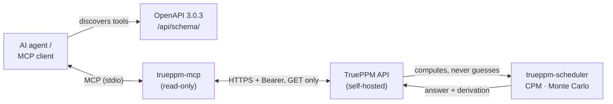

If you are evaluating TruePPM as the system an AI agent reads from and writes to,
this page is the one to read first. It ties together five architectural facts that
are documented individually elsewhere and explains **why**, together, they make
TruePPM a trustworthy foundation for agentic project management — rather than one
more project database with a chatbot bolted on.

The short version is a single principle: **[computed, not
guessed](/architecture/overview/#computed-not-guessed).** An agent should never be
the thing that decides your critical path or your P80 date. It should ask the
engine, and the engine — deterministic, versioned, self-hosted — should answer.
Everything below is in service of that.

:::note[Where this is on the roadmap]
The AI-native foundation is **unshipped and sequenced across releases**. The
read-only MCP server and the first provenance work are targeted at the **0.4
beta** (see the [roadmap](/overview/roadmap/) for shipped-vs-planned status). This
page describes the design and uses future tense for anything not yet tagged.
:::

## The problem this design avoids

Every incumbent PPM tool is bolting a large language model onto a project database
and letting the model answer scheduling questions directly. That fails in a
specific, predictable way: LLMs are strong at extracting intent from unstructured
text and weak at graph traversal, date arithmetic, and constraint propagation —
exactly the math a schedule is made of. Ask a model "if this task slips three days,
when do we ship?" and it will produce a confident, plausible, and frequently wrong
date, with no derivation you can check.

TruePPM takes the opposite stance. The model's only job is to **translate** — turn
your question into an engine call, and phrase the engine's answer back in natural
language. The number itself always comes from the deterministic engine. Five
architectural properties make that division of labor real.

## 1. A discoverable API surface — OpenAPI 3.0.3

Every feature in TruePPM is a REST or WebSocket endpoint before it is a UI element
([API-first](/architecture/overview/#api-first)). The web and mobile clients are
API consumers with no privileged access — an agent gets the same surface they do.

That surface is described by an **OpenAPI 3.0.3** schema served at `/api/schema/`,
the authoritative contract for projects, tasks, dependencies, resources, sprints,
risks, and the rest of the domain. Because modern agent frameworks consume OpenAPI
directly for tool discovery and function calling, an agent can learn how to read
and (eventually) mutate a TruePPM instance from the schema alone — no bespoke
integration code. See the [API stability contract](/api/stability/) for what is
versioned and safe to build against.

## 2. A first-class entry point — the read-only MCP server

An OpenAPI schema tells an agent *how* to call the API. The **[read-only MCP
server](/features/mcp-server/)** (`trueppm-mcp`) gives it a curated, safe *place to
start*. It ships in 0.4 as the beta headliner: point any [Model Context
Protocol](https://modelcontextprotocol.io) client — Claude Desktop, Cursor, Zed —
at your self-hosted instance and ask real questions of the live schedule.

The server will expose a focused set of read-only tools — critical path, a
non-mutating Monte Carlo what-if, sprint status, the risk register, My Work — each
mapping to one existing endpoint and returning only what the caller's role already
permits. It runs as a local subprocess next to your client, talks to TruePPM only
over HTTPS with a scoped `mcp:read` token, and touches no database directly. The
step-by-step client setup lives in [Connect your MCP
client](/features/mcp-connect/).

## 3. The anti-hallucination substrate — a deterministic engine

This is the property that makes the whole design defensible. TruePPM's Critical
Path Method and Monte Carlo risk analysis live in a **standalone, deterministic
package** — [`trueppm-scheduler`](/architecture/overview/#scheduling-as-a-separate-package),
published to PyPI and independent of Django. It handles all four dependency
types, calendar-aware lag, cycle detection, and P50/P80/P95 forecasts (see
[Monte Carlo forecasting](/features/monte-carlo/)). A second Rust + petgraph
CPM implementation (`packages/wasm-scheduler`) is validated against it by a
shared conformance fixture suite in CI; today that Rust engine is a conformance
reference only — the web client's drag preview runs a calendar-approximate
TypeScript worker, reconciled by the authoritative server CPM on commit, and
wiring the WASM build into the browser for in-browser and offline recompute is
future work (#1777).

Because the engine is deterministic and separable, the same inputs always produce
the same schedule, and that schedule can be validated without a running database or
a running model. An agent extracts intent — from a meeting transcript, an email, a
prompt — and hands structured tasks and dependencies to the engine; the engine
computes the timeline. The agent never does the math, so the agent can never
hallucinate the math. That is what **computed, not guessed** means in practice.

## 4. Answers you can cite — the provenance graph

A computed answer is only trustworthy if you can see *why*. The **provenance graph**
(#1058), the first piece of the AI-native foundation, lands with the 0.4 MCP
server: every computed date, float, and P80 will carry the server-side derivation
that produced it — the driving constraint, the lag, the calendar contribution, the
critical chain behind a percentile.

Over MCP this surfaces as a dedicated derivation tool, so an agent's answer can be
"P80 is October 22, derived from this critical chain" rather than a bare assertion.
Provenance is what turns *computed, not guessed* from a slogan into something
auditable: the number arrives with its reasoning attached, and a human — or another
agent — can check it.

## 5. Your data stays yours — self-hosted and Apache 2.0

The single biggest blocker to AI in enterprise PPM is data residency: organizations
will not ship proprietary timelines, resourcing, and forecasts to a third-party
SaaS. TruePPM's community edition is **Apache 2.0** and deploys on your own
infrastructure via Docker Compose or the [Helm chart](/administration/deployment/).

That makes a fully private agent loop possible: run TruePPM and a local model on
your own hardware, point the MCP server at localhost, and no plan and no inference
ever leaves your box. The [natural-language query layer and bring-your-own
local-model adapter](/overview/roadmap/) (#1060, #1061, planned for 0.5) extend this
— the model translates locally, the engine answers locally.

## Human-in-the-loop is the default

TruePPM's data model already prefers **suggestion over override**. Sprint velocity,
for example, feeds non-destructive suggestions into CPM durations rather than
silently rewriting the plan (see [velocity
calibration](/features/velocity-calibration/)). This is the right shape for AI: an
agent proposes an adjustment with its derivation, and a person clicks approve or
reject. The plan is never mutated behind the practitioner's back.

## What is OSS and what is Enterprise

The AI story splits cleanly along the same line as the rest of TruePPM: **a
team's own AI capability is OSS; org-level AI governance is Enterprise.**

| Capability | Edition | Status |
|---|---|---|
| OpenAPI 3.0.3 contract, API-first surface | Community (OSS) | Shipped |
| Deterministic engine (`trueppm-scheduler` on PyPI; Rust/WASM conformance reference, not yet browser-wired) | Community (OSS) | Shipped |
| Read-only MCP server + provenance (query the schedule) | Community (OSS) | Ships in 0.4 |
| Natural-language query layer, local-model adapter | Community (OSS) | Planned for 0.5 |
| MCP write surface (create/update task, move card, log time), engine-as-referee safe writes | Community (OSS) | Planned for 0.6 |
| Reproducible answers (engine-version + input hash) | Community (OSS) | Planned for 0.9 |
| AI scheduling, scenario modeling, cross-program agents, audited automation, approval workflows | Enterprise | — |

The dividing question is the same one the whole product uses: *would a single PM or
team need this to run their program?* Reading and eventually writing your own
schedule with an agent — OSS. Governing what agents may do across many programs,
with an org-wide audit trail and approval gates — Enterprise.

:::caution[What TruePPM does not claim today]
The event surface — [WebSocket broadcasts](/architecture/websocket-events/) and
[webhooks](/features/webhooks/) — makes reactive patterns *possible to build*: an
external agent can subscribe and react to a schedule change. TruePPM does not ship a
built-in reactive agent that drafts alerts on its own, and the MCP server is
**read-only until the 0.6 write surface**. Build reactive automation against the
documented event and API surface; do not assume autonomous write-back exists before
then.
:::

## Where to go next

- [Computed, not guessed](/architecture/overview/#computed-not-guessed) — the
  architectural commitment behind this page, and its full roadmap sequencing.
- [MCP server (read-only)](/features/mcp-server/) — the tool surface, security
  posture, and edition boundary in detail.
- [Connect your MCP client](/features/mcp-connect/) — mint a token and wire up
  Claude Desktop, Cursor, or Zed.
- [Monte Carlo forecasting](/features/monte-carlo/) — the risk engine an agent
  queries for P50/P80/P95.
- [Roadmap](/overview/roadmap/) — the source of record for what has shipped versus
  what is planned.
