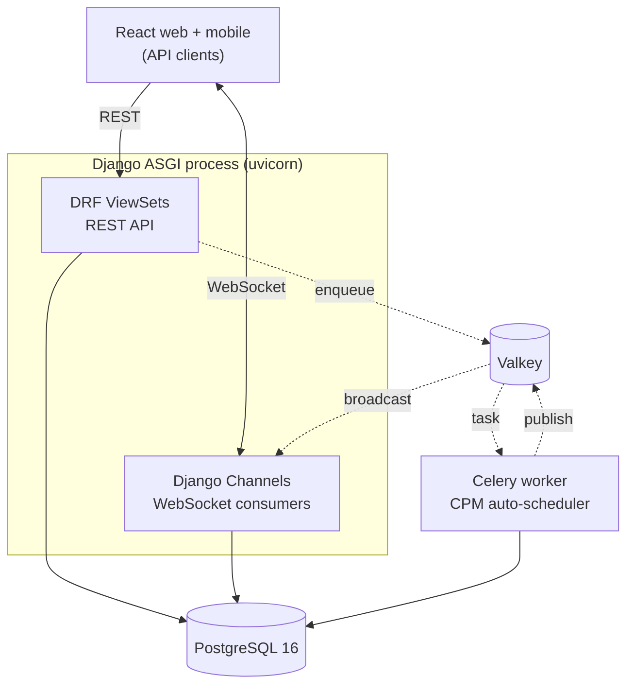

This page describes the architecture of TruePPM as it exists today. The scheduling engine, API, real-time layer, web frontend, and the 0.2 settings/administration and program platform are all functional as of 0.3 — the latest shipped pre-release is `0.3.0-alpha.1` (June 28, 2026), which layered the agile-team feature set and the v2 interface refresh on top of the 0.2 settings/administration and program platform.

## System diagram



**How to read it.** Solid arrows are direct **PostgreSQL** reads and writes;
dotted arrows are asynchronous messages passed through **Valkey**, which is both
the Celery broker and the Django Channels layer. **PostgreSQL** stores every
project, task, and the WBS hierarchy as an `ltree` column with a GiST index for
subtree and ancestor queries.

Follow a schedule change end to end: a write through a **DRF ViewSet** enqueues
a reschedule on the Valkey broker; the **Celery worker** runs the CPM engine,
writes the new dates to PostgreSQL, and publishes the result back through
Valkey; **Django Channels** picks that up off the channel layer and fans it out
to every connected client over its **WebSocket**.

## Key design decisions

### API-first

Every feature is a REST or WebSocket endpoint before it is a UI element. Web and mobile clients have no privileged access — they are API consumers identical to any third-party integration. The OpenAPI schema at `/api/schema/` is the authoritative contract.

The **authoritative** value of any persisted fact — including every scheduled date, float, and Monte Carlo forecast — is always computed server-side and reached over the API. Three narrow compute paths deliberately run *outside* the API, each bounded by one invariant: **the server always has the last word.**

1. **The interactive schedule preview.** Dragging a Gantt bar (or rescheduling with the keyboard) recomputes the affected downstream dates in the browser with no API round-trip, because a request per pointer-move could never stay interactive. That preview is a best-effort, lower-fidelity estimate — it is never persisted, and the authoritative server CPM reconciles the real dates on commit.
2. **On-device / offline recompute.** When there is no network, the API cannot be first, so the client will recompute locally. This is what the Rust/WASM CPM engine is *for*: it is held in conformance with the Python engine in CI so an offline result will match what the server would compute, and the server still reconciles on reconnect. Wiring that engine into the browser and mobile app is future work (#1777) — the shipped preview above runs a TypeScript CPM port until then.
3. **The engine as a library.** `trueppm-scheduler` and its Rust sibling are usable with no API at all (see [Scheduling as a separate package](#scheduling-as-a-separate-package)).

The rule of thumb: if a value is authoritative — if a persisted fact depends on it — it lives server-side behind the API. If it is a discardable preview or an offline stand-in the server will reconcile, it may run at the edge. See [ADR-0599](/architecture/decisions/) for the full boundary.

### Computed, not guessed

_The AI-native foundation — see [AI-native by design](/architecture/ai-native/) for
the consolidated view aimed at agent builders._ Every incumbent is bolting an LLM
onto a project database and letting the model
guess dates. TruePPM takes the opposite stance, and it has a name: **computed,
not guessed.** An AI-surfaced answer is never the language model's opinion — it is
a CPM or Monte Carlo computation the engine performed, carrying a server-side
derivation you can cite. The model's only job is to translate a question into an
engine call and to phrase the engine's answer back in natural language. It never
supplies the number.

This is an architectural commitment, not a feature toggle. It is why the
scheduling engine is a [separate, deterministic package](#scheduling-as-a-separate-package)
and why [every feature is an API fact first](#api-first): if a value is computed
server-side and reachable over the API, an agent can retrieve it and cite it; if
it lived only in a chat prompt, the agent could only guess at it.

```
Incumbent — the LLM is the answer:

    question ─▶ LLM ─▶ asserted answer
                       (a plausible guess; no derivation to check)


TruePPM — the engine is the answer: "computed, not guessed"

    question ─▶ NL layer ─▶ engine call ─▶ provenance-carrying answer
                (translates   (CPM / Monte    ("P80 is Oct 22, derived from
                 to a call)    Carlo computes)  this critical chain" — citable)
```

The principle is sequenced across the roadmap as one capability with four parts —
**compute, cite, refuse, reproduce** — not four scattered AI bullets (see the
[roadmap](/overview/roadmap/)):

- **Compute / cite — provenance graph** (#1058) — every computed date, float, and
  P80 carries the derivation an agent can cite, so an answer is explainable, not
  asserted. It lands with the 0.4 read-only [MCP server](/features/mcp-server/) and
  is already merged to `main`.
- **Reproduce — agent-action audit foundation** (#1805, [ADR-0112](/architecture/decisions/)
  Accepted) — every agent read and every verdict is recorded in a hash-chained,
  `audit_verify`-checkable log; it also lands with the 0.4 beta and is already in
  `main`. A signed engine-version + input-hash answer stamp (#1065) follows at 0.9.
- **Natural-language query layer** (#1060 #1061, planned for 0.5) — compiles a
  question into engine calls, never into an answer; the model translates, the
  engine answers.
- **Refuse — safe agent writes** (#1062–#1064, planned for 0.6) — an engine-as-referee
  refuses any agent write that would create an impossible schedule, identically to a
  human write; this is the *refuse* verb reaching the write side.

The deterministic engine behind all four verbs is shipped today; the compute, cite,
and reproduce foundations land with the 0.4 beta and are already in `main`. The dates
above are targets, not commitments — the [roadmap](/overview/roadmap/) is the source
of record for what has shipped versus what is planned.

### Offline-first sync protocol

The API exposes a WatermelonDB-compatible sync endpoint (`GET /api/v1/projects/{pk}/sync/`) returning `changes` and `deleted` arrays keyed by `server_version`. This is designed for future mobile and PWA clients — see [Offline Sync](/features/offline-sync/) for details.

### Scheduling as a separate package

The CPM and Monte Carlo engine lives in `packages/scheduler` (`trueppm-scheduler` on PyPI), completely independent of Django. This means:

- The engine can be used without the API (embedded in other tools and scripts); a Rust sibling (`packages/wasm-scheduler`) compiles to WASM and is held in conformance with it in CI, for future on-device scheduling (#1777)
- The engine has its own test suite and release cycle
- Algorithmic correctness can be validated without a running database

The Celery worker imports `trueppm-scheduler` as a library, fetches project data from PostgreSQL, calls `schedule()`, and writes CPM output fields back.

### Versioned models and soft delete

Every synced model extends `VersionedModel`:

```python
class VersionedModel(models.Model):
    id             = models.UUIDField(primary_key=True, default=uuid.uuid4)
    server_version = models.BigIntegerField(default=0)
    is_deleted     = models.BooleanField(default=False, db_index=True)
    deleted_version= models.BigIntegerField(null=True, blank=True)
```

`server_version` starts at 1 on INSERT and increments atomically on every UPDATE via an `F()` expression to avoid lost-update races. Deletes are soft: the row is retained with `is_deleted=True` so mobile clients receive a tombstone on the next sync pull.

### Real-time broadcasts

Every mutation is followed by a `broadcast_board_event()` call deferred inside `transaction.on_commit()`. This ensures:

1. The broadcast only fires if the database transaction committed successfully
2. WebSocket clients receive the event as a push, not a poll

## Packages

### packages/scheduler

Pure-Python. Dependencies: `networkx` (graph), `numpy` (Monte Carlo). Ships on PyPI as `trueppm-scheduler`.

### packages/web

React 19 + TypeScript + Vite 6. Tailwind CSS with Design System v2.0 (navy/sage) tokens (WCAG 2.1 AA). TanStack Query for server state, Zustand for client state, React Router v7. The Schedule view (Gantt-style) uses a purpose-built canvas renderer in `src/features/schedule/engine/` (no third-party Gantt library). The application shell, Schedule, Board, Sprints, and supporting views are wired against the live API.

### packages/api

Django 5.2 + DRF 3.15. Django Channels 4 (ASGI). Celery 5.4 + Valkey (BSD-licensed Redis fork; wire-compatible). django-allauth + simplejwt. drf-spectacular (OpenAPI 3.0.3). PostgreSQL 16 with `ltree` for WBS hierarchy.

### packages/website

This Astro Starlight site. Built with `npx astro build`; deploys to GitLab Pages.

### packages/helm

Helm 3 chart with vendored first-party sub-charts for PostgreSQL and Valkey (under `packages/helm/charts/`, using the official `postgres` and `valkey/valkey` images). Separate `values-dev.yaml` and `values-prod.yaml` overlays.

## OSS / Enterprise boundary

The community edition must never import from `trueppm_enterprise`. The dependency is strictly one-way: enterprise → core.

```bash
# Verify the boundary is clean
grep -r "trueppm_enterprise" packages/
# must return zero results
```

**Community:** scheduling engine, CPM, Monte Carlo, Schedule (Gantt-style) UI, Board, Sprints workspace, program management (coordinating multiple projects within a program), baseline comparison, offline sync, real-time, 5-role RBAC, REST/WS API, Helm chart, MS Project import/export. On the Community roadmap but not yet shipped: basic single sign-on (OIDC/OAuth login against your own identity provider) lands in 0.4; the mobile apps and time tracking land in 0.5.

**Enterprise (separate repo):** portfolio analytics and health scores, cross-program resource leveling, org identity governance (SAML 2.0 federation, SCIM provisioning, LDAP/AD directory sync, enforced org-wide SSO), immutable audit trail, custom roles, approval workflows, the org-wide Jira/GitLab/ServiceNow integration hub, AI scheduling, scenario modeling, multi-tenancy.

The OSS unit is the **program** (one PM, one or more related projects). The Enterprise unit is the **portfolio** (multiple programs under organizational governance).
