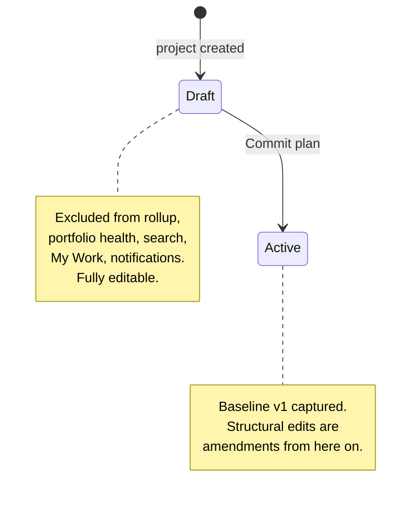

A **baseline** is a frozen snapshot of your project's schedule at a point in time. Capture
one when you commit a plan to stakeholders, then compare it against the live schedule to
see exactly how far — and which tasks — have drifted.
:::note[Ships in 0.4]
The **in-app** capture and management described on this page ships in **TruePPM
0.4**, the first beta. The latest released version is `v0.3.0-alpha.3`, where
baselines exist over the REST API only — there is no Actions-menu entry and no
baseline manager. The API behavior below is unchanged.
:::


## Committing the plan

Most projects get their first baseline automatically, by being **committed**.

A new project starts as a **draft** — a plan nobody has agreed to yet. A draft is fully
writable; what it is not is *visible*. TruePPM holds a draft out of program rollup,
portfolio health, search, My Work and the notification fan-out, so a half-built plan
cannot quietly become part of an aggregate someone reports upward.

Committing ends that. On the project **Overview**, a draft shows a **Draft** chip, and a
Project Manager sees a **Commit plan** button beside **Update Status**:



Committing is a single transaction that does two things:

1. **Captures `Baseline v1`** and makes it active — including a copy of the working
   calendar the dates were computed against, stored *by value*. A later calendar edit
   therefore changes your variance rather than silently moving the thing variance is
   measured from.
2. **Flips the project from draft to active**, so it joins every aggregate it was held
   out of.

You can keep editing afterwards — committing is not a lock. What changes is that editing
a committed plan is **amending** it: a structural edit carries a reason into the project's
[change history](/features/change-history/) and notifies the people whose work moved.

**You cannot un-commit.** A plan is committed once, so that the anchor every variance
number is measured from cannot move. Committing a second time returns `409`.

```bash
# Commit the plan. Requires the Project Manager role. Returns 409 if already committed.
curl -X POST -H "Authorization: Bearer $JWT" \
  https://trueppm.example.com/api/v1/projects/$PROJECT_ID/commit/
```

```json
{
  "baseline_id": "8f14e45f-ceea-467a-9f6b-2c1a3e9d4b70",
  "baseline_name": "Baseline v1",
  "task_count": 12,
  "assigned_resource_count": 4
}
```

`assigned_resource_count` is how many people hold a resource assignment in the plan you
just committed — the audience the commit concerns. It is **not** a count of notifications
sent; committing sends none. People are notified when their work later *moves*, which is
the amendment path described above.

| Method & path | Purpose | Permission |
|---|---|---|
| `POST /api/v1/projects/{id}/commit/` | Commit the plan; capture `Baseline v1` | Project Manager (`ADMIN`) |

Structured rebaseline reasons and a post-commit changeset view are planned for 0.5.

## Capturing and managing baselines in the app

Beyond the automatic `Baseline v1`, you can capture further baselines at any time — for
example one per phase gate.

From the **Schedule** view, open the Actions (**···**) menu:

- **Capture baseline** takes a snapshot of every task's current planned dates. It
  requires the Project Manager role, auto-names the snapshot (`Baseline N`), and makes it
  active. A short confirmation first explains what a baseline is and — if one is already
  active — reminds you that capturing a new one keeps the previous baseline in the
  project's history rather than overwriting it. You can also capture from the **Baseline**
  section of a task's detail drawer when no baseline exists yet.
- **Baselines…** opens the baseline manager, where any project member can see every
  baseline (name, capture date, and task count) and which one is active. A Project
  Manager can **Set active** to switch the comparison baseline, and a Project Owner can
  **Delete** one.

The same operations are available through the [REST API](#capturing-and-managing-baselines-via-the-api)
for automation. Baseline ghost bars drawn directly on the Gantt canvas and structured
rebaseline reasons are planned for 0.5.

## What a baseline captures

Capturing a baseline records, for every task in the project at that moment:

- the task name (kept even if the task is later deleted),
- planned **start** and **finish** dates,
- **duration**, and any **actual** start/finish already recorded.

Snapshots are **immutable** — once written, a baseline's task rows never change, so a
baseline remains a faithful record of what the plan looked like when you took it. A
baseline notes whether its tasks had computed CPM dates at capture time, so a comparison
can flag a snapshot that was taken before the schedule was fully calculated.

## Multiple baselines

A project can hold **many baselines** — for example one per phase gate — but **one is
active** at a time. The active baseline is the one used for comparison. Activating a
different baseline automatically deactivates the previous one.

## Capturing and managing baselines via the API

All endpoints are project-scoped and authenticated with a bearer token (`$JWT`);
`$PROJECT_ID` is the project UUID.

```bash
# 1. Capture a baseline (name optional — auto-named "Baseline N" if omitted).
#    Requires the Project Manager role. Snapshots every task atomically.
curl -X POST -H "Authorization: Bearer $JWT" -H "Content-Type: application/json" \
  -d '{"name": "Phase 1 commit"}' \
  https://trueppm.example.com/api/v1/projects/$PROJECT_ID/baselines/

# 2. List baselines for the project.
curl -H "Authorization: Bearer $JWT" \
  https://trueppm.example.com/api/v1/projects/$PROJECT_ID/baselines/

# 3. Activate a baseline (deactivates any other). Requires the Project Manager role.
curl -X POST -H "Authorization: Bearer $JWT" \
  https://trueppm.example.com/api/v1/projects/$PROJECT_ID/baselines/$BASELINE_ID/activate/

# 4. Delete a baseline. Requires the Project Admin (owner) role.
curl -X DELETE -H "Authorization: Bearer $JWT" \
  https://trueppm.example.com/api/v1/projects/$PROJECT_ID/baselines/$BASELINE_ID/
```

| Method & path | Purpose | Permission |
|---|---|---|
| `GET /api/v1/projects/{id}/baselines/` | List baselines | Project member |
| `POST /api/v1/projects/{id}/baselines/` | Capture a baseline (auto-named if blank) | Project Manager (`ADMIN`) |
| `GET /api/v1/projects/{id}/baselines/{baselineId}/` | Retrieve (with task count) | Project member |
| `POST /api/v1/projects/{id}/baselines/{baselineId}/activate/` | Make active, deactivate others | Project Manager (`ADMIN`) |
| `DELETE /api/v1/projects/{id}/baselines/{baselineId}/` | Delete a baseline | Project Admin (`OWNER`) |

## Comparing against the plan

Once a baseline is **active**, opening a task in the Schedule view shows a **Baseline**
section in the task detail drawer with the planned-vs-current comparison for that task:

| Planned (baseline) | Current (live) | Delta |
|---|---|---|
| Start / finish at capture | Start / finish from the latest CPM run | Variance in days (e.g. `+3 days`) |

The same per-task comparison is available directly from the API:

```bash
# Active baseline vs current schedule for a single task.
curl -H "Authorization: Bearer $JWT" \
  https://trueppm.example.com/api/v1/projects/$PROJECT_ID/tasks/$TASK_ID/baseline/
```

The response is discriminated by `has_baseline` / `in_baseline`: it reports no baseline,
a task added after the baseline was taken, or a full comparison row with
`start_delta_days` / `finish_delta_days` (positive = slipping later than planned).

`current_start` and `start_delta_days` compare against the task's **span**
(`scheduled_start` — see [the bar vs. the remaining-work
window](/features/schedule/#the-bar-vs-the-remaining-work-window)), not the
narrower *remaining-work* window that `early_start` shrinks toward as an
in-progress task approaches completion. Comparing against the remaining-work
window would make `start_delta_days` grow purely from progress being
reported, not from any actual schedule slip.
