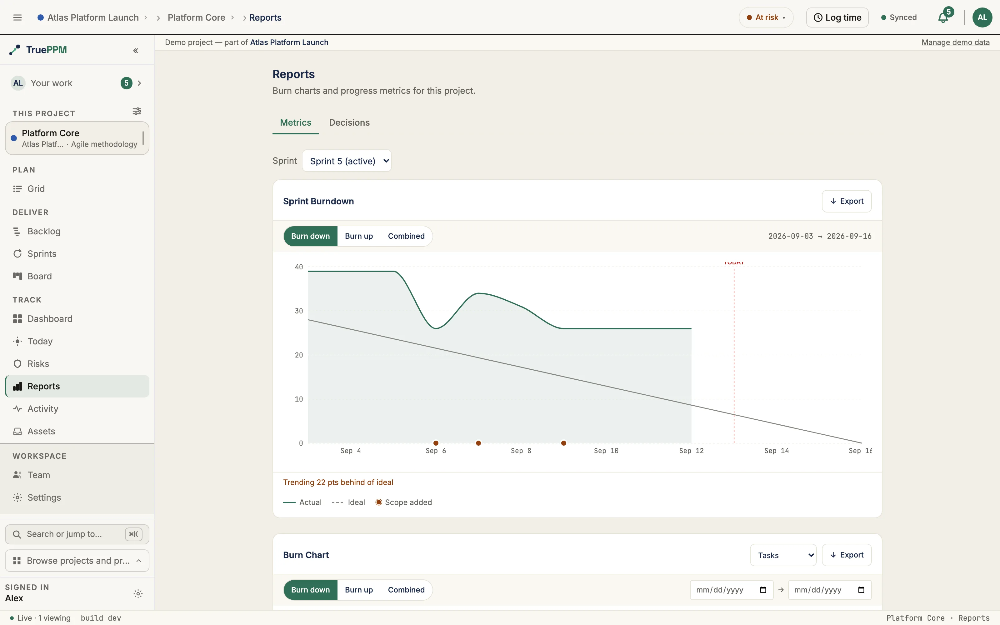

Three standard agile/iterative progress charts scoped to a single project: burn down (remaining work over time), burn up (completed work against a scope line), and a combined overlay of both. All three share a Y-axis unit selector — story points or task count — so you can read them in the unit that matches your planning cadence.

Portfolio-level burn charts (aggregated across projects) are an Enterprise feature.

## Where this lives in the story

Step 7 ([Forecast and confidence](/the-story/#7-forecast--monte-carlo-across-both-worlds)) of the [hybrid PM flow](/the-story/). Carlos checks this tab to answer "are we still on track?" before his weekly executive update; Maya uses it between sprints to spot scope drift that the sprint burndown doesn't show.

## Chart variants

### Burn Down

Plots remaining work from the project start date to today. The ideal burn line runs from total scope at start to zero at the planned finish date. From 0.4, a project that started more than 366 days ago is charted over its most recent 366 days rather than its whole history — see the window limits under [API endpoints](#api-endpoints).

- **Y-axis:** remaining story points / task count (user-selectable)
- **X-axis:** calendar dates across the charted window — project start to planned finish
- **Ideal line (dashed):** straight diagonal from total scope to zero
- **Actual line (solid):** cumulative remaining work per day
- A line above the ideal means you're behind; below means ahead.

### Burn Up

Shows how much work has been completed as scope grows over time.

- **Completed line (solid):** cumulative done work per day, growing from zero
- **Scope line (dashed):** total scope per day — flat until a scope change, then stepping up or down
- The gap between the two lines is the remaining backlog. A narrowing gap means delivery; a widening scope line means scope creep.

### Combined

Overlays burn down and burn up on the same axes. The area between the two lines is the active backlog — useful for presenting at reviews where both the "how much is left" and "how much is done" questions arise in the same conversation.

## Where to find it in the app

- Route: `/projects/:projectId/reports`
- Tab: **Reports** — visible for HYBRID, AGILE, and WATERFALL projects
- Mode selector in the chart toolbar: **Burn Down · Burn Up · Combined**
- Unit selector: **Points · Tasks**
- Date range: the **From** / **To** pickers in the chart toolbar (project charts only — in a sprint the range is the sprint). From 0.4 the range they can ask for is bounded; the limits are under [API endpoints](#api-endpoints)

## API endpoints

| Method | Endpoint | Purpose |
|---|---|---|
| `GET` | `/api/v1/projects/{id}/burn/` | Burn chart data series for the project |

Query parameters:

| Parameter | Values | Default |
|---|---|---|
| `chart_type` | `burndown`, `burnup`, `combined` | `burndown` |
| `metric` | `tasks`, `points` | `tasks` |
| `since` | ISO date (window start) | project start date |
| `until` | ISO date (window end) | today |

:::note[Ships in 0.4]
The window bounds described in the next paragraph ship in **TruePPM 0.4**, the
first beta. In `v0.3.0-alpha.3`, the latest release, the window has no upper
bound: any span and any future `until` are accepted (only `until` before `since`
is refused), and a far-future `until` such as `9999-12-31` returns a 500.
:::

From 0.4 the window will be bounded on both axes. `until` may be at most 31 days
past today, and the span between `since` and `until` at most 366 days: an `until`
past that horizon, or an explicit `since` more than 366 days before `until`, is a
400 naming the limit. A request that supplies no `since` — or an empty one — is
never refused for span; the window is clamped to the 366 days ending at `until`
instead, and the response echoes the `since` it actually used.

The response echoes `chart_type`, `metric`, `since`, and `until`, plus a `series` array with one entry per calendar day. For `burndown`/`burnup`, each row is `{date, actual, ideal, scope}`; for `combined`, rows are `{date, remaining, completed, total, ideal}`. For `burndown` / `burnup` only, a project with an active baseline also gets a `baseline_series` planned-remaining overlay (`{date, planned}` rows); `combined` does not carry one.

`IsAuthenticated` + project read permission required. Project must be a member of the requesting user's accessible projects.

## Related ADRs

- [ADR-0022](/architecture/decisions/) — Burn charts: API endpoint design and snapshot semantics
- [ADR-0062](/architecture/decisions/) — Burn charts web implementation (recharts, combined mode, unit selector)

## If you are…

- **Carlos (executive)** — open the Reports tab before your weekly update. The Combined chart answers "how much is left and how much is done" in one view. A diverging scope line is your prompt to ask the PM what changed.
- **Maya (Scrum Master)** — use Burn Down between sprints to see whether the project-level trajectory matches what the sprint burndowns predict. Sprint burndowns show iteration health; this shows project health.
- **Diana (PMO / Portfolio Manager)** — the Burn Up chart's scope line tells you whether this project is taking on more work than it planned. Scope creep here often explains why the milestone dates drift in the Schedule view.
