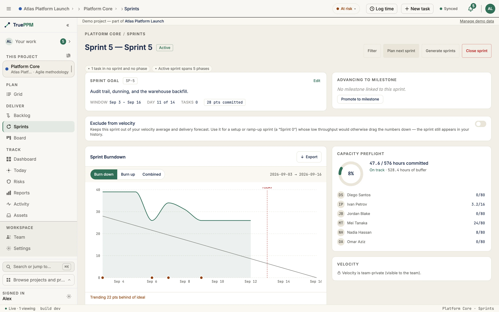

This is the Resource Manager's at-a-glance check of an active sprint's workload,
before the sprint starts: a donut chart showing the team's overall committed hours
against available hours, and a list of what each person is committed to. Three
color bands flag severity — under, at, or over capacity — so contention shows up
at planning time rather than partway through the sprint.

## Where this lives in the story

Step 3 ([Capacity preflight](/the-story/#3-capacity-preflight--the-resource-manager-vetoes)) of the [hybrid PM flow](/the-story/) — Sarah's veto surface. Catches contention at plan time before sprint execution starts.

## What you see

- **Donut chart** — the ratio of hours committed to hours available for the whole
  team, colored by how tight it is:
  - under 90% — on track (green)
  - 90–100% — at risk (amber)
  - over 100% — over capacity (red)
- **Aggregate label** — a line like *"32 / 40 hours committed · On track · 8 hours
  of buffer"* (or *"... hours overrun"* once you're past capacity)
- **Per-person rows** — each teammate's initials, name, and their own
  committed-vs-available hours; anyone over-allocated gets a red-tinted avatar so
  they stand out in the list

## Points ceiling (added in 0.3)

:::note[Added in 0.3]
The points chip and capacity footer below were added in 0.3 (the agile team release), available since the `0.3.0-alpha.1` pre-release (Jun 28, 2026).
:::

The per-person hours view answers "who is overcommitted?" A team that plans in
**story points** (the team's own relative-size unit for a piece of work, instead of
a time estimate) also needs to know "are we over the sprint's points ceiling?" When
the sprint has a planning-capacity ceiling set, the panel adds a points-based read
alongside the hours view:

- **Points chip** — shows committed points against the ceiling and the percentage,
  adding up the story points of every task committed to the sprint. It turns red
  once the committed points go over the sprint's ceiling.
- **Plain-English footer** — a one-line summary the whole team can read without
  parsing the donut: *"Team is at 75% of capacity. 6 pts free."* (or *"Team is 4
  pts over capacity."* once over the ceiling).

Both are **left off entirely when no points ceiling is set** — a sprint that plans
in hours only never sees an empty or zero-valued points chip. The points ceiling is
**not** part of creating a sprint — the [Plan Sprint dialog](/features/plan-sprint/)
is deliberately minimal (name, dates, optional goal) and has no points field. Set
or change it from the **Capacity** card on the Board's active-sprint panel: click
the card and type a value, or clear it to go back to hours-only. You can change it
any time while the sprint stays open.

## Where to find it in the app

- Route: `/projects/:projectId/sprints` (right column of the metrics row, top half)

## API endpoints

| Method | Endpoint | Purpose |
|---|---|---|
| `GET` | `/api/v1/sprints/{id}/capacity/` | Per-member committed/available hours + aggregate totals |

Activating a sprint also runs a lighter warnings-only version of this same check; this endpoint exposes the full underlying numbers.

## Where the data comes from

For everyone assigned to a task in the sprint, TruePPM works out:

- **Committed hours** — each person's share of a task (their assignment
  percentage) multiplied by the working days in the sprint and the hours in a
  working day, added up across all their tasks in the sprint.
- **Available hours** — the same calculation, but using each person's full
  capacity instead of their assignment percentage — i.e., how many hours they
  could theoretically give the sprint.

"Working days" follows the project's [working-day calendar](/features/calendars/)
— which days of the week count as working, and how many hours make up a working
day (8 hours by default).

Time off isn't factored in yet — it counts as zero hours until a dedicated
time-off feature ships.

## Related ADRs

- [ADR-0037 §Q2](/architecture/decisions/) — Capacity check at activate time

## If you are…

- **Sarah (Resource Manager)** — this is your veto surface. If the aggregate is over 100% before activate, escalate before the sprint starts.
- **Maya (Scrum Master)** — the per-person list answers "who's overcommitted?" without a separate spreadsheet. The points footer (0.3) gives you the one-line "are we over the ceiling?" answer to read out at planning.
- **Raj (PM)** — capacity warnings on activate inform whether to pull scope before the sprint window opens.
