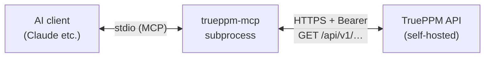

:::note[Coming in 0.4]
The read-only MCP server ships in 0.4, TruePPM's first beta. On unreleased
builds the tool list may still be changing.
:::

TruePPM ships a read-only [Model Context Protocol](https://modelcontextprotocol.io)
server, `trueppm-mcp`, that lets any MCP client — Claude Desktop, Cursor, Zed,
and the like — ask real questions of your self-hosted instance: the critical
path, a Monte Carlo slip forecast, sprint status, the risk register, My Work.
Answers are computed server-side by the same CPM/Monte Carlo engine the web UI
uses, never guessed by a model, and nothing leaves your box.

The MCP server is the first place you feel TruePPM's AI principle —
**computed, not guessed.** Every incumbent bolts an LLM onto a project database
and lets the model guess dates; here the model only translates your question into
an engine call, and the CPM/Monte Carlo engine supplies the number. The answer is
a computation with a derivation, not a language model's opinion. See
[Computed, not guessed](/architecture/overview/#computed-not-guessed)
for the full architectural picture.

:::note[Edition]
The MCP server is part of the **Community (OSS)** edition (Apache 2.0). It
exposes only data the requesting user can already read under their existing
role. Org-wide AI governance (cross-program agents, audited automation, approval
workflows) is an Enterprise overlay and is not part of this server.
:::

:::caution[Read-only by design]
This server exposes **no write tools** and issues only `GET` requests. The write
surface (create/update task, move card, log time) is deliberately held to a
later release.
:::

## How it works

`trueppm-mcp` is a thin protocol adapter. It runs **next to your AI client** —
typically as a local subprocess the client spawns — and talks to TruePPM **only
over HTTP** via the public REST API, carrying your API token as a bearer
credential. It never touches the database or the ORM, so your role-based
permissions are enforced exactly once, at the API layer. The server can see
nothing you could not already read in the web client with the same token.



## Quickstart

The server is configured entirely from the environment — no config file on disk.
It authenticates with a **personal access token** (`tppm_<64-hex>`) carrying the
**`mcp:read` scope**. The read surface accepts only owner-scoped (personal)
tokens — a project- or program-scoped token is rejected here — so the credential
reads only what your role permits and nothing beyond it.

The fastest way to connect: **Personal Settings → API tokens → Create token**,
then choose the **"Read-only for AI assistants"** scope (`mcp:read`) and **set an
expiry** (required for `mcp:read`). The reveal dialog shows the raw token once,
plus a ready-to-paste `claude_desktop_config.json` snippet built from it — copy
that straight into your client and skip the manual assembly below.

| Variable | Required | Description |
|----------|----------|-------------|
| `TRUEPPM_API_URL` | yes | Base URL of your instance, e.g. `https://ppm.example.com` (the `/api/v1` suffix is added automatically if omitted) |
| `TRUEPPM_API_TOKEN` | yes | A personal access token (`tppm_<64-hex>`) with the `mcp:read` scope and an expiry |

Install from PyPI and run it as a local subprocess (the primary, stdio
transport):

```bash
pip install trueppm-mcp
TRUEPPM_API_URL=https://ppm.example.com \
TRUEPPM_API_TOKEN=tppm_your_token_here \
  trueppm-mcp            # stdio (default); Ctrl-C to stop
```

On startup the server calls `GET /api/v1/auth/me/` once to confirm the token
authenticates, so a bad token fails the boot immediately with a clear message
rather than letting every query fail later.

### Wiring it into Claude Desktop

stdio is the primary transport: the AI client launches the server as a
subprocess and speaks MCP over the pipe. If you minted an `mcp:read` token
from the Integrations settings page above, paste its generated snippet and
you're done. Otherwise, add an entry to `claude_desktop_config.json` by hand:

```json
{
  "mcpServers": {
    "trueppm": {
      "command": "trueppm-mcp",
      "env": {
        "TRUEPPM_API_URL": "https://ppm.example.com",
        "TRUEPPM_API_TOKEN": "tppm_your_token_here"
      }
    }
  }
}
```

Restart the client; it will spawn `trueppm-mcp` on demand. For the HTTP/SSE
transports, Docker deployment, token scopes, and the full security posture, see
the [MCP server administration guide](/administration/mcp-server/).

## What it can answer

The server registers **18 read-only tools**, each mapping to one existing REST
endpoint and returning only what your role permits. Results are compacted for an
LLM context budget: empty and null fields are omitted, long free-text fields are
truncated (with a `"truncated": true` marker), and project/program results carry
a `caller_role` field — your own authoritative role, passed straight through from
the API.

Every `list_*` tool returns an `{ "items": [...], "total_count": N }` envelope
rather than a bare list. The API paginates at 50 rows per page, so the server
follows the pages for you up to a 1,000-row cap; if more rows still exist than
were returned, the envelope adds `"truncated": true` so the assistant knows it is
looking at a partial set and should narrow the query (a filter, a smaller scope)
rather than reason over an incomplete list.

### Projects & programs

| Tool | Arguments | Returns |
|------|-----------|---------|
| `list_projects` | — | Every project you can read, each with your `caller_role`. |
| `get_project` | `project_id` | Full project metadata and a health overview, with `caller_role`. |
| `list_programs` | — | Every program you can read, each with your `caller_role`. |
| `get_program_health` | `program_id` | Rollup health for one program (single-program; cross-program rollups are Enterprise). |
| `list_program_backlog` | `program_id` | A program's backlog intake pool — items ranked by priority, with type, status, story points, and whether each has been pulled into a task. Single-program only. |

### Tasks & work

| Tool | Arguments | Returns |
|------|-----------|---------|
| `list_tasks` | `project_id`, and optional `status`, `assignee`, `sprint`, `is_critical`, `type`, `updated_after` (alias `since`) | A project's tasks, filtered and compacted. |
| `get_task` | `task_id` | Full detail for one task (dates, assignee, acceptance criteria, sprint). |
| `get_board_state` | `project_id` | The board's columns and their task cards for one project. |
| `list_my_work` | — | Your assigned tasks across every project you belong to. |

### Schedule & risk

| Tool | Arguments | Returns |
|------|-----------|---------|
| `get_schedule_summary` | `project_id` | CPM finish, Monte Carlo P50/P80/P95, SPI, and the critical-task count. |
| `get_monte_carlo_forecast` | `project_id` | The latest **persisted** Monte Carlo run (P50/P80/P95, `cpm_finish`, delta). Read-only — never triggers a new simulation. |
| `get_release_forecast` | `project_id` | Backlog delivery forecast from the team's velocity Monte Carlo: P50/P80 **sprint counts** and calendar dates to clear the committed backlog (plus P95 date). Always a range, never a single date; returns a `warming_up` shape when velocity history is thin. |
| `whatif` | `project_id`, `task_id`, one of `duration_delta` / `new_duration`, optional `n_simulations` | **What breaks if this task's duration changes.** Perturbs one task and recomputes CPM + Monte Carlo **in memory, persisting nothing**. Returns `current` vs. `whatif` P50/P80/P95, the deterministic CPM finish for each, `critical_path_changed`, and `delta_vs_current` (signed calendar-day shifts, positive = later/worse). |
| `get_schedule_derivation` | `project_id`, `task_id`, `quantity` | The server-computed *why* behind a value: the driving predecessor/successor, the binding constraint, lag and calendar contributions, and which pass set it. `quantity` is a CPM value (`early_start`, `early_finish`, `late_start`, `late_finish`, `total_float`, `free_float`) or a Monte Carlo percentile (`p50`, `p80`, `p95`). Cite the reason, not just the number. |
| `list_risks` | `project_id` | The project's risk register (impact, probability, status). |

### Sprints

| Tool | Arguments | Returns |
|------|-----------|---------|
| `list_sprints` | `project_id` | The project's sprints (health bands and aggregates only — no per-person velocity). |
| `get_sprint` | `sprint_id` | One sprint with its project's health band (aggregates only). |

### Identity

| Tool | Arguments | Returns |
|------|-----------|---------|
| `whoami` | — | The identity behind your configured token — a quick connection check. |

## Example prompts

Once connected, ask your assistant natural-language questions and it will pick
the right tool:

- "Which of my projects are behind their P80 forecast?"
- "Show me the critical path for the Apollo project and how much slack the near-critical tasks have."
- "What's on my plate this sprint?"
- "List the open high-impact risks for the Mercury program."
- "What breaks if I slip the integration task 5 days?"

### "What breaks if I slip this task 5 days?"

This is the tool no metered-connector agent can answer — it needs a scheduling
engine, not a database read. Ask it in plain language and your assistant chains
the tools for you:

1. `list_tasks` (or `get_task`) to resolve the task you named to its `task_id`.
2. `whatif` with that `task_id` and `duration_delta: 5`.

The engine runs a baseline and a perturbed pass, then answers with computed
numbers — not a guess:

> Slipping **"Integration testing"** by 5 days pushes the **P80 finish from
> 2026-09-15 to 2026-09-22** (+7 calendar days) and the deterministic CPM finish
> by the same. **`critical_path_changed: true`** — the slip pulls the "Data
> migration" task onto the critical path, so it is now the one to watch.

`whatif` persists nothing: it writes no rows, caches nothing, and enqueues no
recompute. Run it as many times as you like to compare options — pass
`duration_delta: -2` to see the effect of *pulling a task in*, or `new_duration`
to set an absolute duration. It is reachable by any `mcp:read` token because it
is a pure read/compute modeled as a `GET`.

## Security notes

- **One enforcement point.** Authorization is enforced by the API, identically
  for this server and the web client. The MCP process holds no privileged path
  and is not a second copy of the permission model.
- **No secret in logs.** The token is never logged, never echoed in an error,
  and never included in a stack trace.
- **Read-only.** The server defines only read tools and issues only `GET`
  requests. The write surface is held to a later release.
- **Self-hosted.** All traffic stays between your AI client, the server, and
  your own API — no third-party service is involved.
