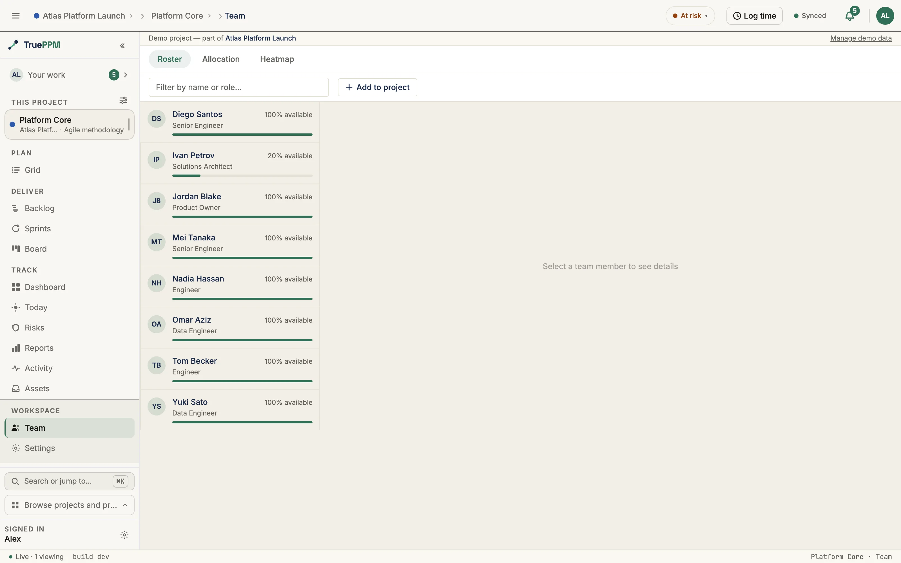
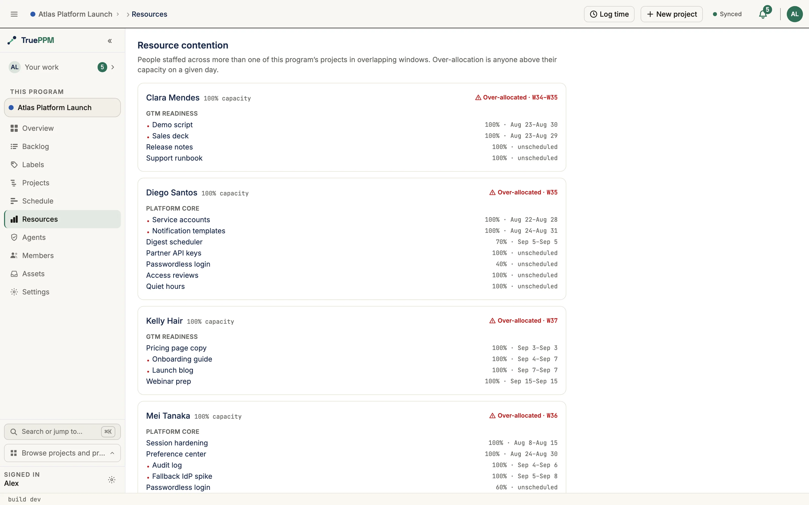
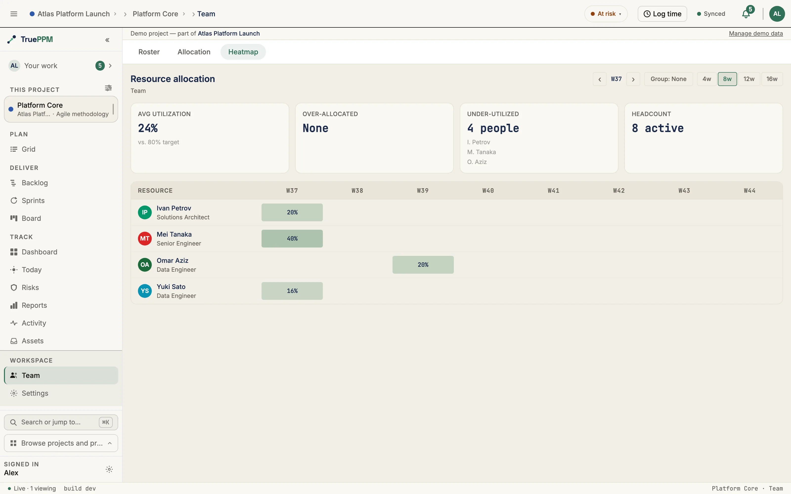

TruePPM models the people who do the work as **resources**. Resources live in a
Workspace-wide catalog, carry **skills** at a proficiency level, join a **project
roster**, and get **assigned to tasks** at a fractional capacity. When you assign someone,
TruePPM surfaces soft warnings if their skills don't match the task or if they're
overcommitted.

:::note[0.1]
The resource and skill catalog shipped in 0.1 and is part of the **Community (OSS)**
edition. **Cross-program** resource leveling and portfolio-wide heat maps are part of the
Enterprise edition.
:::

## The resource catalog

A **resource** has a name, email, job role, an optional calendar (to model individual
availability), and a **max units** value expressing capacity — `1.0` is a full-time
equivalent, `0.5` is half-time. Resources are Workspace-level: create them once and use
them across projects. Removing a resource soft-deletes it, so historical assignments stay
intact, and it can be restored later.

## Skills and proficiency

A **skill** is a Workspace-level tag (optionally grouped into a category). Tag a
resource with the skills they have at one of three proficiency levels — **Beginner**,
**Intermediate**, or **Expert**. Skill names are de-duplicated case-insensitively, so
"React" and "react" resolve to the same skill.

Tag skills inline from a resource's detail panel: choose a proficiency, then search the
catalog under **+ Add skill**. Each selection is added immediately and the search clears,
so you can tag several skills in a row; skills already on the resource are hidden from the
results.

## Rosters and assignments

- **Project roster** — add resources to a project before (or without) assigning them to
  specific work. A roster entry can override the resource's job role or capacity for that
  project. The **capacity override** says "this person is only half on this project"; see
  [what the capacity override governs](#what-the-capacity-override-governs).
- **Task assignment** — assign a resource to a task at a fractional **units** value (e.g.
  `0.5` for half their capacity). Assigning someone who isn't yet on the roster adds them
  automatically.

## Assignments across projects

:::note[Ships in 0.4 — the Assignments view]
The **Assignments** view on a resource's detail panel will ship in 0.4 as part of
the **Community (OSS)** edition.
:::

Opening a person's card in the Workspace resource catalog will answer the first
question a resource manager has — *what is this person working on?* The detail
panel will gain an **Assignments** section that lists every task the resource is
assigned to, **across every project**, grouped by project. Each task row links to
that task in its project schedule, and each project heading links to that project's
allocation view, so you can drill from the catalog straight into the work.

Every row shows the task's status, percent complete, and the resource's allocation
on that task (the raw `units` fraction of their capacity). A neutral summary — for
example *"3 tasks across 2 projects"* — sits at the top. The view is **read-only**:
it projects the assignments that already exist and lets you read the load yourself.
It does **not** compute a utilization score, flag overallocation, or roll up across
programs — cross-program resource leveling and portfolio heat maps remain part of
the Enterprise edition.

Because task and project names are project-scoped, the Assignments section will be
visible only to a **workspace Admin**. Everyone else, project admins included,
still sees the rest of the resource card
(role, capacity, skills) but not the assignments list. The view reaches into every
project in the installation, and a project-level role does not carry that far: any
account can create a project and become its Owner, so a project role cannot stand in
for installation-wide authority.

To see what someone is working on **within the projects you are a member of**, read
`GET /api/v1/task-resources/?resource=<id>`, which is scoped to your own
memberships and needs no elevated role.

## Skill-fit and overallocation warnings

You can attach **skill requirements** to a task — the skills (and minimum proficiency) the
work needs. When you assign a resource, TruePPM evaluates the fit and returns it with the
assignment:

- **Exact** — the resource meets every requirement.
- **Partial** — some requirements met, some short on proficiency.
- **Missing** — the resource lacks one or more required skills (listed explicitly).

Separately, if a resource's committed allocation on any single working day exceeds their
max units, the assignment comes back with an **overallocation** warning naming that day.
Both checks are **soft** — they inform the assigner but never block the assignment, so you
stay in control.

The overallocation check windows by date against the same calendar-aware engine as the
heatmap, so the two cannot disagree about who is overcommitted: three 80% tasks that never
share a working day are 80% allocated, not 240%. Two consequences are worth knowing:

- **Non-working days are not conflicts.** Spans that meet only across a weekend, or only
  on a calendar exception, do not stack. A resource's own calendar wins over the
  project's, exactly as it does on the heatmap.
- **A task with no scheduled dates counts against every day.** An unscheduled task has no
  window that could rule out an overlap, so it is treated as concurrent with everything
  else. This keeps the warning meaningful on a project whose schedule has not been
  calculated yet — which is often when the first assignments are made.
- **A very large project may show a partial roster, and says when it does.** The
  allocation timeline and the program contention view cap how many assignments one
  response carries. The cut always lands on a whole person: someone is either shown with
  every one of their in-window tasks, or left out and counted in a notice above the list
  ("Showing 40 of 62 resources"). Nobody is ever shown with only part of their work,
  because a partial view of a person would under-report exactly the overcommitment these
  views exist to surface. The cap is set clear of the supported project size, so you
  should not meet it. If you do, the notice names the remedy that surface actually
  offers: the project allocation timeline can narrow the window or search by name, and
  the program contention view — which has no filters yet — points you at a member
  project's Resources view instead.

:::note[Ships in 0.4]
Date windowing on the overallocation warning ships in 0.4. Through 0.3 the warning sums a
resource's units across every active task in the project with no date window, so
non-overlapping work reports as overallocated.
:::

## Team utilization on the project Overview

The project Overview carries a **Team utilization** KPI card: this week's committed
load as a percentage of the team's working capacity. It is computed from the same
calendar-aware engine as the resource heatmap — hours per day × units × working
days, with a resource's own calendar winning over the project's — so the Overview
card and the heatmap cannot disagree about how loaded a team is.

Three details are worth knowing:

- **The window is the current week (Monday–Sunday).** The card answers "how loaded
  is this team *now*", so work scheduled for next month does not raise it. A
  project-lifetime average would read as calm straight through a crunch week.
- **Everyone measured counts on both sides.** The population is the project roster
  plus anyone holding an assignment this week. A rostered person with no
  assignments is idle capacity and lowers the percentage; someone assigned without
  being on the roster still brings their own capacity, so they cannot show up as a
  phantom overallocation. A per-project **capacity override** on the roster wins
  over the resource's default max units — as it does on every other per-project
  capacity read; see [what the capacity override governs](#what-the-capacity-override-governs).
- **A task's load is measured over its full span, not its remaining work.**

  :::note[Ships in 0.4]
  Windowing utilization on the task **span** rather than the remaining-work
  window ships in **TruePPM 0.4**, the first beta. It is not present in the
  current release: before 0.4, an in-progress task's contribution to the
  heatmap and the Team utilization card shrinks as `percent_complete` rises,
  and can drop out of the window entirely once its remaining-work window no
  longer intersects the query range.
  :::

  The heatmap and the Team utilization card both window a task's assignments
  on its **span** (`scheduled_start` through finish — see [the bar vs. the
  remaining-work window](/features/schedule/#the-bar-vs-the-remaining-work-window)),
  not on the narrower *remaining-work* window that `early_start` shrinks
  toward as a task approaches completion. A person's allocation on a task
  does not shrink just because they finished part of it — reporting progress
  moves a task closer to done; it does not delete the load they were
  assigned in the first place.

**0%** is a real reading — it means nobody is allocated this week. When the ratio
is genuinely undefined the card is muted and says why, rather than showing a blank:

| The card says | It means |
| --- | --- |
| `Needs people on the project roster` | The project has no roster and no assignments, so there is nothing to measure. |
| `Roster has no working hours this week` | Everyone on the roster is at zero capacity, or every calendar is closed for the whole week. |

Clicking the card opens the Team view, which is available to the **Scheduler** role
and above; for a Member or Viewer the card is a static read rather than a link into
a permission error.

## What the capacity override governs

:::note[Ships in 0.4]
Applying the roster capacity override beyond the Team utilization card ships in **0.4**.
In the current release only that card reads it: the heatmap, the Team summary, the
allocation timeline, the overallocation warnings and the project attention feed all
measure against the resource's catalog-wide **max units**, so a person rostered at `0.5`
and assigned `0.5` reads 100% on the Overview card and 50% on the heatmap one click away.
:::

A roster entry's **capacity override** is a statement about *this project*: "this person
is only half on this project." From 0.4 every capacity figure scoped to a single project
will measure against it rather than against the resource's catalog-wide max units:

- the **resource heatmap** and the **Team summary** (weekly percent, over-allocated count)
- **daily utilization** and its load bands — on track, at risk, over
- the **Team utilization** KPI card on the project Overview
- the **allocation timeline** on the project's Team view
- the **overallocation warning** shown when you assign someone
- the **overallocated** row in the project's attention feed, and the overallocation
  indicator on a task
- the **sprint capacity** preflight panel

Two things it deliberately does not change:

- **Cross-project views keep the resource's own max units.** A person's row in a
  program's **resource contention** view spans several projects at once, so there is no
  single project whose override applies — and the overrides are slices of one person's
  time rather than capacities that add up. That view states the whole person.
- **`0` means zero, not "unset."** An override of `0` is a real value — rostered on this
  project, holding no capacity here — and is never read as an absent override. Clear the
  field instead to fall back to the resource's max units.

The overallocation indicator on a task changes for a second reason: it compared every
assignee against a flat 100%, with no capacity figure at all. From 0.4 it reads the same
capacity as everything else, so a person whose **max units** is not `1.0` is affected even
with no override — someone at `1.5` stops being flagged at 130%, and someone at `0.8`
starts being flagged at 90%. An assignee with no linked resource still uses 100%.

## What a resource manager can do today

1. Maintain the Workspace resource catalog (name, role, capacity, calendar). Email
   addresses can be **set**, but from 0.4 the **catalog** endpoints will not return
   them to anyone except a workspace Admin and the person the resource
   represents — the catalog is readable by every signed-in user, so echoing every
   address would make it an org-wide address book. Note this covers the catalog
   endpoints only. The project and program **resource-allocation** views and the
   project **seed export** build their responses separately and still include
   `email` for resources attached to a project you administer.
2. Maintain the Workspace skill catalog and tag resources with proficiency.
3. Build per-project rosters with role and capacity overrides.
4. Assign resources to tasks at fractional capacity.
5. Define per-task skill requirements and see skill-fit on assignment.
6. See overallocation warnings when someone is overcommitted.
7. View project utilization across the team, on the resource heatmap and as a
   this-week percentage on the project Overview.
8. See, from a resource's card, every task they are assigned to across all
   projects — grouped by project, read-only (ships in 0.4).
9. Remove resources from a project roster (cascading task assignments when forced).

**Deactivating or restoring a resource in the Workspace catalog will require the
workspace Admin role from 0.4** — it soft-deletes a shared record and recalculates
the schedule of every project that person is assigned to, including projects the
actor cannot see. Taking someone off *your* project's roster is unchanged and stays
with the Resource Manager role.

## API

The catalog and assignment surfaces are exposed under
`/api/v1/resources/`, `/api/v1/skills/`, `/api/v1/resource-skills/`,
`/api/v1/project-resources/`, `/api/v1/task-resources/`, and
`/api/v1/task-skill-requirements/`. Reading resources requires any authenticated user.
Creating and editing catalog resources requires the **Project Manager** or **Project
Admin** role on at least one **active** project; editing the skill catalog, rosters,
and task assignments requires the **Resource Manager** role or above on at least one
**active** project. Roles held on an archived or deleted project will stop counting
in 0.4 — an archived project is declared read-only, so it no longer confers authority
anywhere else either.

`POST /api/v1/skills/` de-duplicates on the case-insensitive normalized name, so
posting a name that already exists is not an error. Telling the two apart from the
status code — `201` when the skill was added to the catalog, `200` when an existing
row is returned unchanged — ships in 0.4; until then the endpoint answers `200` in
both cases. The response body is identical either way, so a client that needs to
know whether it created the skill must read the status code.

:::note[Ships in 0.4]
**Archived projects refuse roster and assignment writes.** Adding or removing a roster
member, assigning or unassigning a resource, and adding, editing or deleting a task's
skill requirements are all refused with a `403` once the project is archived — at every
role including Owner, because archiving makes a plan read-only and that is a property of
the plan rather than of the caller. Reads are unaffected: an archived project's roster,
assignments and skill requirements stay fully readable. Unarchive the project to edit it
again. The Workspace-level catalogs (`/api/v1/resources/`, `/api/v1/skills/`,
`/api/v1/resource-skills/`) are not project-scoped and are unaffected.

In `v0.3.0-alpha.3` (the latest release) these writes still succeed on an archived
project.
:::

From 0.4 the following four surfaces will require the **workspace Admin** role
rather than a project role:

| Surface | Why |
| --- | --- |
| `DELETE /api/v1/resources/{id}/` and `POST .../restore/` | Soft-deletes a shared record and recalculates every project the person is assigned to. |
| `email` on catalog rows, and `?search=` by email | The catalog is readable by every signed-in user; a project role would make it an org-wide address book. |
| `?include_deleted=true` on the catalog | Enumerates the deactivated pool. |
| `GET /api/v1/resources/{id}/assignments/` | Returns task and project names for one person across every project in the installation. |

Each of these reaches the whole installation, and a project role cannot bound it:
project creation is deliberately open, so any account can hold Owner on a project of
its own. A workspace role is different — it is granted from **Settings → Members** by
someone who already holds it (or by your identity provider, if you use SSO), so it
cannot be self-assigned. If you are the only administrator of a fresh install, you
already have it: an account with Django superuser rights and no workspace membership
row resolves to workspace Owner. Use `GET /api/v1/task-resources/?resource=<id>` for the membership-scoped
view of one person's assignments.
