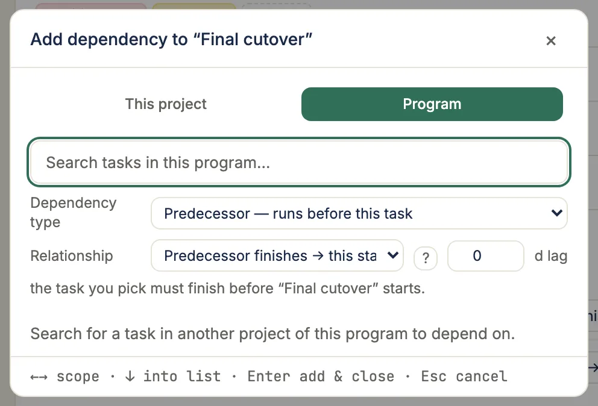
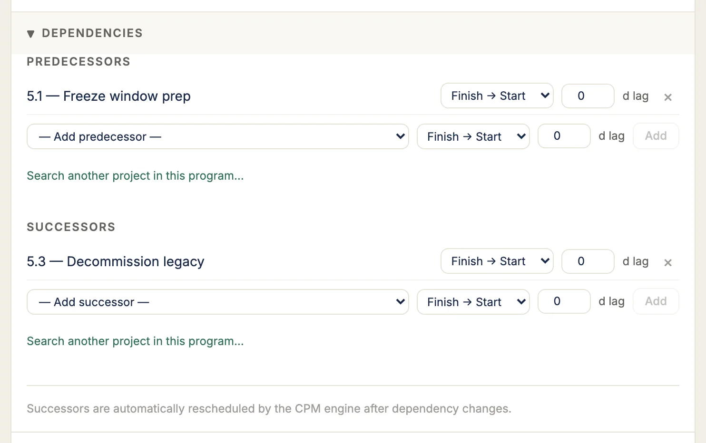

## Task detail drawer

### Opening a task

Every schedule row carries an **Open** button at the trailing edge of its name,
revealed when you hover the row or focus anything in it. It opens the task detail
drawer for that row, and it is present on **both** schedule layouts — Grid and
Timeline — because both render the same outline rows.

Two other ways in:

- **Alt + Enter** on a focused row, which needs no mouse.
- **Double-click a task's bar** on the Timeline canvas. Single-click on a bar stays
  selection-only (it draws the ring and the dependency chain), so double-click is
  the "show me the details" gesture there.

The task **name** cell is deliberately not the open target: it is an edit target,
taking inline rename, `F2`, and the name-autocomplete popover. A click that opened
a drawer would fight the thing that cell already does.

The drawer opens on the right (a bottom sheet on mobile). The
header shows the WBS number, a readiness chip, a **CP** marker when the task is
on the critical path, and the task name as an inline-editable field. Below it,
the drawer groups everything about the task into four tabs:

- **Details** — a schedule strip (Start, Finish, Duration, Float, with a
  critical-path banner when float is zero), status and progress, assignees, the
  description, dependencies, and the secondary planning sections (sprint,
  estimates, recurrence). **Duration is editable right here** — click it and type
  a new value (e.g. `10`, or `2w` for two working weeks) instead of dragging the
  bar; Start, Finish, and Float re-compute the moment you commit. Milestones have
  no duration, and Viewers see it read-only. From 0.4 the Float cell will also
  carry a `free 2d` chip whenever this task's free float differs from its total
  float — that is, whenever it has a successor close enough to be pushed. When the
  two are the same number the chip stays away rather than printing it twice.
- **Subtasks** — the checklist breakdown, with a done/total count on the tab.
- **Activity** — notes, comments, an **All events** timeline (field changes plus
  system recalculations and schedule, risk, time and attachment events), and baseline.
- **Files** — attachments and external links.

Most fields autosave the moment you change them — picking a status, nudging
progress, ticking a subtask, posting a comment, or attaching a file all take
effect immediately. The one exception is the free-text **Description**: it edits
locally and a save bar appears while you have unsaved changes, so a half-typed
note is never committed by accident. That edit still flushes automatically when
you blur the field, switch tabs, or close the drawer, and a notice warns you if
someone else changed the description while you were typing.

The Description supports lightweight **Markdown** — `**bold**`, bullet and
numbered lists, and `` `inline code` `` — so acceptance criteria, checklists,
and governance notes stay scannable. When the field is unfocused it renders the
formatted result; click it to edit the raw Markdown, and blur to return to the
rendered view. Viewers see the rendered description read-only.

The tabs are extension points: each section registers against the
`task_detail.section` slot with a priority and a tab, so TruePPM Enterprise can
add its own sections without the community edition knowing about them.

### Progress-to-100 auto status

Dragging the progress slider (or the schedule grid's inline percent cell) to
**100%** is a status transition, not just a number. If the edit doesn't also
set a status explicitly, and the task isn't already past sign-off, TruePPM
auto-promotes it:

- **Project Manager and Project Admin**: straight to **Complete**,
  which also stamps today as the actual finish date.
- **Everyone else who can edit the task** (Team Member): to **Review**,
  pending PM/PMO sign-off — the task does not show as Complete yet.

A task already in **Review**, **Complete**, or **Backlog** is left alone —
promoting a Backlog idea straight to done is an edge case that requires an
explicit status change instead.

Because the outcome depends on who is dragging the slider, a confirmation
dialog names the actual target status before the write commits — "Mark task
Complete?" or "Send task to Review?" — so the same gesture never produces a
surprising, invisible difference between two people's screens. Cancel and the
slider reverts to its last saved value with no write sent. Setting status
directly (from the **Status** dropdown, or from the Board) always takes that
explicit value and skips this auto-promotion entirely.

## Dependency types

Finish-to-Start dependencies render as collision-avoiding Manhattan-routed arrows; the other three (SS, FF, SF) render as cubic-Bézier curves:

| Type | Name | Meaning |
|------|------|---------|
| FS | Finish-to-Start | Successor starts after predecessor finishes |
| SS | Start-to-Start | Successor starts after predecessor starts |
| FF | Finish-to-Finish | Successor finishes after predecessor finishes |
| SF | Start-to-Finish | Successor finishes after predecessor starts |

All dependency arrows are drawn in charcoal (`COLOR.arrowNormal`) — critical-path state is conveyed by the bar color, not the arrow. Arrows route orthogonally and divert around intervening task bars and milestone diamonds, so a line never visually pierces another row's object on its way to the successor.

**Driving vs non-driving links.** In a dense chain, arrows carry a weight hierarchy so the sequence that actually controls dates reads as the strong line through the graph. A **driving** link — the predecessor whose relationship free float is zero, so it pins its successor's start — draws at full weight; a **non-driving** (slack) link draws thinner and at reduced contrast and recedes. Which links drive is a scheduling-engine fact, not a client guess: the CPM pass computes it and the API carries it per dependency (`is_driving`), so the two arms of a merge point read differently even though both endpoints may be off the critical path. Weight and contrast do the work — never color — so this never collides with the critical-path bars or the blue/green hover-chain interrogation, which still take precedence. Until a project has been recomputed the weighting is dormant and every link renders at full weight.

## Creating a dependency

**Drag-to-link (mouse / trackpad).** Hover a task bar to reveal its link handle, then drag from it to another bar to draw a **Finish-to-Start** dependency — the bar you start on becomes the predecessor, the bar you drop on the successor. A dashed guide line follows the cursor while you hunt; it snaps solid with a target ring over a valid successor, and shows a *not-allowed* cursor over an invalid drop (such as a link back to the same task). Release to create the link: the dependency arrow appears immediately, so the drawn arrow is its own confirmation. A drop that would form a cycle is refused with an error. Drag-to-link is pointer-fine only — on touch, and for keyboard users, use the picker below; the two are equivalent.

The **picker** — a search-and-pick dialog for the same result, and the way to create the other three dependency types — opens from two places:

- **Right-click a task row** in the task list and choose **Add dependency…**.
- **Open the task detail drawer**, expand the **Dependencies** section, and use the same **Add predecessor** / **Add successor** controls — or, for a task in another project, the **Search another project in this program…** link underneath them.

The task detail drawer's own **Dependencies** section lists existing predecessors and successors with their type and lag inline, and offers the same add controls without opening the picker:

For a standalone project, the picker searches only that project's tasks. For a project that belongs to a program, it gains a **This project / Program** toggle: Program scope searches every sibling project in the program and groups the results by project, so you can gate a task against work owned by another team. A cross-project link you create may land as **pending** rather than immediately active — see [Program schedule](/features/program-schedule/) for how the counterpart team accepts it and how the link is drawn once accepted.

**Stating the link's terms.** Above the results sit three controls.

**Dependency type** is the direction: whether the task you pick becomes this task's **successor** (the default — it runs after) or its **predecessor** (it runs before). Because it is a field rather than a consequence of which menu item you used, picking the wrong side costs one dropdown rather than closing the dialog and retyping the search.

**Relationship** is which ends are tied together, and its four options are worded for the direction in force — in successor mode "This finishes → successor starts", in predecessor mode "Predecessor finishes → this starts". They describe the same four types either way; the wording exists because an arrow alone means opposite things on the two sides. Changing direction resets this to Finish-to-Start, since a relationship chosen for one side rarely survives the flip. A **?** beside the field explains all four types and how lag reads.

The **lag** field takes a lag in days, where a **negative** number is a *lead*: `-2` lets the successor start two days before the predecessor's constraint would otherwise allow.

Under the three, a plain-language line restates the link you are about to create, naming both tasks — "“Foundation” must finish before “Framing” starts." Before you highlight a row it names the gap instead ("the task you pick"), so it is readable while you are still deciding. Whatever the two say is what the next link you add is created with, so a non-Finish-to-Start link is stated once, here, rather than created as Finish-to-Start and corrected afterwards in the drawer.

Both settings persist while the picker is open, so adding three Start-to-Start links in one visit is one decision rather than three. They apply to the link being added, not to links already on the task — to change an existing link, use the **Dependencies** section of the task detail drawer, which is still where links are edited and removed.

The drawer's **Dependencies** section takes the same two settings when you add a link there: its **Add predecessor** / **Add successor** rows carry a type dropdown and a lag field, so a link created from the drawer states its terms up front too.

**Searching the picker.** Type to narrow the list. A term starting with a **digit** is read as a **WBS prefix** — `1.` returns everything in phase 1 — and anything else as a **name substring**. Whichever part of the row matched is highlighted, so you can see at a glance *why* a row is in the list. A `3 of 4 matches` count sits above the list in both scopes; when more rows match than the list can show, it says so and asks you to keep typing.

**Working the picker from the keyboard.** The search field keeps the cursor the whole time, so you never have to tab into the results:

| Key | What it does |
| --- | --- |
| `↓` | Steps into the results list, landing on the **first** row; press again to move down |
| `↑` | Moves up; from the first row it hands the cursor back to the search field |
| `Space` | **Adds the highlighted row and keeps the picker open**, so you can link several predecessors in one visit |
| `Enter` | Adds the highlighted row and closes |
| `←` / `→` | Switches between This project and Program scope |
| `Esc` | Closes without linking |

`Space` only adds once `↓` has moved you into the list — before that it types a space, so you can search for `site plan` without creating anything. The footer hint tracks which of the two you are in. Each row you add leaves the list as it lands, and a line above the results counts what you have linked so far. Clicking a row still adds that one link and closes the picker; adding several in one visit is a keyboard gesture.

In Program scope the search runs on the server and matches a task's **name or its notes**, so a match found only in the notes highlights nothing in the row — and a term starting with a digit is matched as a name substring there rather than as a WBS prefix. That search returns at most 200 rows; when it hits that ceiling the count says so and asks you to narrow.

## Put an unscheduled task on the timeline

A task with no **committed start** draws no bar. It has dates — CPM calculates an earliest start for everything it schedules — but those are the scheduler's answer, not yours, and they move whenever a predecessor does. Until you commit a start, the task waits in the **To Do** section of the Unscheduled gutter beneath the timeline.

The gutter appears only while it is holding something. On a project where every task has a committed start there is no tray at all — an empty queue is not a status worth a permanent strip across the bottom of your timeline, so you get the canvas height back instead. It returns the moment a task loses its date or a new one is captured without one.

Its count is a control, not a label: click the **(N)** beside "Unscheduled" to jump the outline to the next task the tray is counting, expanding a collapsed phase if the task is hidden inside one. Click it again for the next. This only moves you — it writes nothing. To commit dates to several tasks at once, use **Schedule N…** beside it, which selects them and opens the bulk editor.

Three ways to commit one, from its `···` menu:

- **Start at the earliest** — commits the date CPM already calculated: the soonest the task can begin given its predecessors and the project calendar. One click, nothing to type.
- **Start today** — commits today's date. If a predecessor means the task cannot actually begin today, this still commits — the resulting gap between your committed date and the calculated one is a real conflict worth seeing, not one the menu should hide from you.
- **Or pick a date** — the date field, pre-filled with the calculated earliest start so you are adjusting a real answer rather than starting from a blank.

Each action names the date it will commit, because the first two are frequently *different* dates: on a task waiting behind unfinished work, "the earliest" is later than today; on a plan that has already slipped, it is in the past. When the two resolve to the same day the menu shows a single action instead of two identical ones.

You can also **drag the chip from the gutter onto the timeline** to commit the date you drop it on. All four paths write the same field, and CPM cascades the rest of the plan in the same motion.

:::tip
Committing a start that has already arrived also moves the task to **In progress** — the same rule that applies to any committed date reaching today, wherever it is set from.
:::

## Promote a backlog idea onto the schedule

The **Unscheduled gutter** beneath the timeline now includes a **Backlog** section listing tasks that have been captured but not yet scheduled. Backlog cards are visually distinct — a dashed edge and a readiness label — so it's clear that placing one on the timeline does more than move it.

To pull a backlog item into your plan, **drag its card from the gutter up onto the timeline**. Dropping it adds the idea to the sprint at the drop date — a confirmation reads "Added '{name}' to the sprint, starting {date}" — and CPM cascades the rest of the plan automatically, so any successors re-forecast in the same motion. The drop dialog speaks in sprint terms ("Add to a sprint", a **Target date**) rather than CPM vocabulary, so you don't need to know about early start or float to commit an idea.

If you'd rather not drag — or you're working from the keyboard — every backlog card has an **Add to a sprint** action (both in the gutter and on the [Board](/features/board/)). It opens a target-date picker and does exactly the same thing: add the idea to the sprint at the chosen date.
