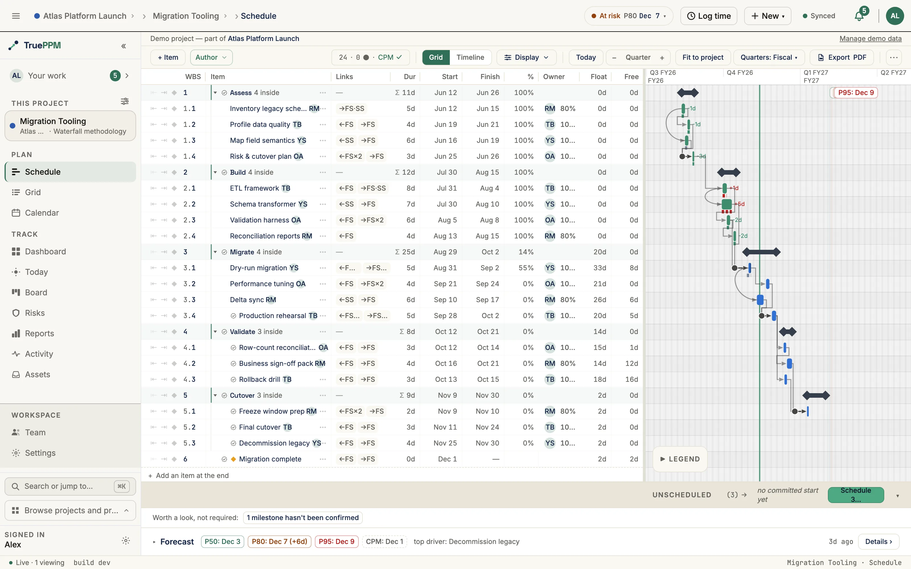
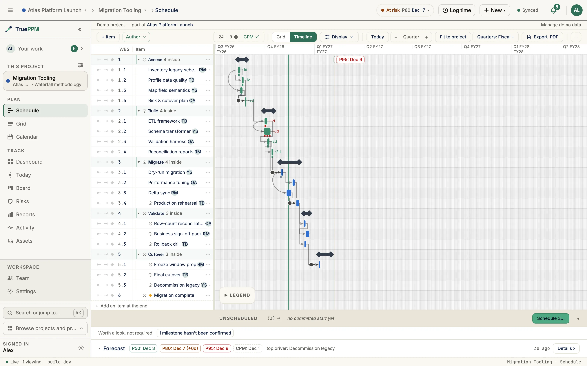

This is the home view for a PM planning and tracking a project's timeline. The **Schedule view** is TruePPM's project-timeline surface — what the rest of the industry calls a *Gantt chart*. TruePPM calls it **Schedule** in the product because the view does more than a historical Gantt chart: the **critical path** (the chain of dependent tasks that determines the earliest the project can finish), baselines, milestones, the unscheduled gutter, and a live re-forecast driven by **CPM** — the Critical Path Method, the calculation engine that works out every task's dates from durations and dependencies — off sprint velocity all live in the same canvas.

:::note[A note on "Gantt"]
*Gantt chart* is the well-known industry term and is what most evaluators search for. We use **Schedule** in product copy and route names; the underlying paradigm is still a Gantt. The two words refer to the same thing in this docs site.
:::

## In this section

- [Schedule dates](/features/schedule/dates/) — committed, computed and actual dates on the Schedule: what each one means, when the server changes a date, and scheduling before the project start.
- [Editing the schedule](/features/schedule/editing/) — the task detail drawer, dependency types, creating dependencies, and moving unscheduled tasks and backlog ideas onto the timeline.
- [Sprint windows on the schedule](/features/schedule/sprint-windows/) — how sprint windows are drawn on the Schedule, and what they tell a PM and a Scrum Master.

## Where this lives in the story

Step 2 ([Schedule the skeleton — CPM, milestones, baseline](/the-story/#2-schedule-the-skeleton--cpm-milestones-baseline)) and Step 6 ([Execute](/the-story/#6-execute--daily-cadence-two-worlds-in-sync)) of the [hybrid PM flow](/the-story/) — Sarah's home; the view that auto-re-forecasts when the team moves a card on the board.

## Where to find it in the app

- Route: `/projects/:projectId/schedule`
- Tab: **Schedule** (visible by default for HYBRID and WATERFALL projects per [methodology preset](/features/methodology-preset/))

## How to read these dates

Every date on this view — the bars, the Start and Finish columns, the milestone
diamonds — comes from the **CPM pass**. It is the *earliest feasible* schedule:
what happens if every task takes exactly the duration you estimated, no task
slips, and no risk fires. That makes it a single point, and an optimistic one.

This matters because a Gantt bar looks like a commitment. It isn't one. In
practice the CPM finish lands close to the **P50** of the same project's
[Monte Carlo forecast](/features/monte-carlo/) — meaning roughly even odds of
hitting it. Committing to the date on the bar is committing to a coin flip.

The [Forecast](#forecast) bar below the timeline is
where the confidence bands live. The short version:

| | What it is | What to do with it |
|---|---|---|
| The bars on this view | The deterministic CPM schedule — earliest feasible | Plan, sequence, find the critical path |
| **P50** | Half of simulated runs finished by here | Read as a midpoint, never quote it |
| **P80** | 4 in 5 runs finished by here | **The date you commit to** |
| **P95** | 19 in 20 runs finished by here | Contractual and externally-visible deadlines |

So a Finish column reading `3 Mar` next to a P80 of `14 Mar` is not a
contradiction — it is the risk premium the CPM pass cannot express. See
[Interpreting results](/features/monte-carlo/#interpreting-results) for the
full treatment, including what to do when all three percentiles come back
identical.

:::note[Computed is not the same as committed]
A separate distinction, easy to conflate: a task can carry a PM-set **committed
start** or run purely on **computed** CPM dates, and the app flags the second
case where it matters. That is about *provenance* — who put the date there.
This section is about *probability* — how likely any date is to hold. A
committed date is no more likely to be met than a computed one. The provenance
axis is covered in full below:
[Committed vs computed start dates](/features/schedule/dates/#committed-vs-computed-start-dates).
:::

## Layout

Split-pane: a virtualized task list on the left (ten columns — WBS, Task, Links, Dur, Start, Finish, %, Owner, Float, Free — all but Task hideable and resizable, persisted via `localStorage`), and the canvas timeline on the right. Scroll is synchronized in both directions. The **Links** column names the types of each row's dependencies and opens the picker — see [Task-list columns](/features/schedule-toolbar/#the-links-column).

:::tip[Build the plan from the keyboard]
The task list is [Schedule build mode](/features/schedule-build-mode/) — a keyboard-first construction surface, on by default: type a task, `Alt + →` to indent, `Space` to complete, `F2` to edit. It builds the schedule; sprint planning still lives on the [Board](/features/board/).
:::

### Float and free float

The engine computes two kinds of slack for every task, and 0.4 put both in
the outline as their own columns:

| Column | Reads | Answers |
|---|---|---|
| **Float** | Total float | How long can this task slip before the **project finish** moves? |
| **Free** | Free float | How long can it slip before **the task after it** has to move? |

Free float is never larger than total float, and the two are equal for a task with
nothing downstream of it. The gap between them is the useful part: a task with
`8d` of total float and `2d` of free float has eight days of room in the plan but
only two before its own successor is pushed, so spending the other six costs
somebody else their start date. See the [scheduler
reference](/features/scheduler/#task-outputs) for how each is derived.

Both columns will be read-only, right-aligned, and set in tabular figures so a
column of them scans. A task the scheduler has not reached yet will show an em
dash rather than `0d` — no answer yet and no slack left are opposite readings, and
only one of them is a warning. **Negative float** — a task that is already late
against the project finish — will read in the critical color, in bold, with its
minus sign.

Which of them you see by default follows the project's [methodology
preset](/features/methodology-preset/): both will be **on** for Waterfall and
Hybrid projects, where float is the number a planner scans a plan by, and **off**
for Agile projects, whose Schedule tab is not in the nav by default. That is a
default, not a restriction — turn either on or off from **Display ▸ Columns** on
any project and the choice sticks.

Sorting is a Table/Grid affordance rather than a Schedule one: the outline's row
order **is** the work breakdown structure, so it cannot be re-ordered by a column
without destroying the containment it exists to show. To rank tasks by slack, open
the same two columns on the [Table/Grid view](/features/schedule-toolbar/#layout-grid-and-timeline), where they will be
sortable. Tasks with no computed float sort last in both directions.

### On a narrow desktop window

The outline and the bar track share one row, and the track is what makes the view a
timeline — so on a window too narrow to hold both at their full width, the **outline
gives ground first**. It keeps the columns you sized and clips the rightmost ones;
the bar track holds a 320px floor and stays readable. Nothing you set is changed:
widen the window, or collapse the left rail, and your outline comes back exactly as
it was. Drag the divider if you would rather spend the width the other way.

Worth knowing what that costs in practice, because the numbers are not obvious. At
1280px with the left rail expanded the eight-column outline already asks for more
room than the clamp can give it, so the Owner column has always been the first to
clip there. The two float columns added in 0.4 are the rightmost pair, which puts them
first in line: at 1440px and above the full ten-column set fits, and below that you
will want to hide a column you are not reading, collapse the rail, or drag the
divider. That order is deliberate — float is the pair a planner consults rather
than reads on every row, so it is the right thing to spend first.

### On a phone

Below the `md` breakpoint the split-pane canvas gives way to a dedicated
touch-native surface: a vertically-scrolling, WBS-ordered list where each row
carries the task name, its planned dates, `% complete`, and a compact timeline
strip. Every strip is drawn against one shared project window, so the rows read
top-to-bottom as a cascade you can scan for sequence and slack. The critical
path shows as a border cue plus a warning glyph (never colour alone), milestones
render as an amber diamond, and tasks with no dates collect in a collapsible
**Unscheduled** tray at the top. Tap any row to open its detail sheet; leaf
tasks you can edit get a one-tap complete. The Monte Carlo forecast card stays
pinned at the bottom. This is a read-and-navigate surface — reschedule and
drag-to-plan stay on the desktop canvas.

## Canvas renderer

TruePPM ships its own canvas Schedule renderer in `packages/web/src/features/schedule/engine/`. It replaced an earlier SVAR React Gantt integration to remove third-party constraints on drag UX, accessibility (ARIA grid overlay), and dark-mode rendering. Three layered canvases (background, bars, interaction) are dirty-rect repainted; row virtualization is mandatory from the first commit. See [ADR-0040](/architecture/decisions/) for the full rationale.

## Bar types

| Bar type | Token | Meaning |
|----------|-------|---------|
| Normal | `barNormal` | Standard task, not on the critical path |
| Critical | `barCritical` (`semantic-critical`) | Task is on the critical path (total float = 0) |
| Complete | `barComplete` (`semantic-on-track`) | Task marked as 100% complete |
| Summary | `barSummary` 8px tall | WBS parent / summary row |
| Milestone | Diamond | Zero-duration event (`is_milestone=true`) |
| Actual-date overlay | `ghost-fill`/`ghost-border` 6px, dashed | A task's recorded actual start/finish, drawn below the live bar once it has at least one actual date; colored by schedule variance (late/early/in-progress) |

:::note[Not the same thing as a baseline overlay]
This dashed bar reads a task's own `actualStart`/`actualFinish` fields — it is
unrelated to a **baseline** comparison. The planned-vs-baseline ghost-bar
overlay on the Gantt is a separate, not-yet-shipped surface: see
[Baselines](/features/baselines/#capturing-and-managing-baselines-via-the-api)
for what capturing a baseline does today and when the overlay itself lands.
:::

Bar labels use `COLOR.text` (`#1A1917` light / palette swap in dark mode). The canvas font is set once at engine init to the Tailwind `font-sans` stack so labels match the task list typography.

### Legend

A floating panel over the bottom-left of the timeline (1024px and wider) names every mark the canvas draws, grouped under **Bars** (task, summary, milestone, critical path, delivery-mode and sprint-window marks), **Lines** (today line and dependency arrows), and **Gestures** (pan, open details, drag-to-link). Every swatch keeps a text label. It is open the first time you ever visit a Schedule view, and closed by default on every visit after (and always on the first visit to the read-only demo) — a toolbar toggle (**Legend**, next to the Grid/Timeline switch) and the panel's own close control both show and hide it, and stay in sync with each other. Whichever state you leave it in persists across reloads; at a narrower toolbar width the toggle moves into the **Actions** menu rather than disappearing. In the read-only demo, where it is the only way to find the legend, it is the last control to move there.

## Zoom

You can zoom smoothly from hour-level detail all the way out to a multi-year overview — there are no fixed steps to click through. As you zoom, the two-row date header automatically changes the unit it emphasizes (day → week → month → quarter → year) so the timeline always stays readable.

Three ways to zoom:

- **Toolbar stepper** — the **−**, current-level, and **+** controls, plus a **Fit to project** button that frames the whole project in the viewport.
- **Wheel / pinch** — hold **Ctrl/Cmd** and scroll the mouse wheel, or pinch on a trackpad, while pointing at the timeline. The zoom centers on the cursor: the date under your pointer stays put while everything else scales around it.
- **Touch (tablet)** — on the timeline canvas, **pinch with two fingers** to zoom; the point between your fingers stays put as the scale changes.
- **Row height follows the pointer** — schedule rows are 28px with a mouse or trackpad and **44px on a touch device**, so the row and its controls meet the touch-target minimum. The taller row applies to the timeline canvas as well as the outline: a bar is itself a drag target, so it gets the same room. It is keyed on the pointer rather than the window width, so a tablet with a keyboard attached keeps the compact rows and re-flows if you detach it. You can also ask for the taller rows on a mouse: **Display → Outline → Comfortable rows** raises the row height to 44px on any pointer. It raises a floor rather than setting one, so a touch device stays at 44px whether the option is on or off.
- **How-to bar** — the teaching band under the plan shows a short how-to while nothing in the outline is selected, and hands the band to the [build-mode hint strip](/features/schedule-build-mode/) as soon as you focus a row. **Display → Outline → How-to bar** turns the how-to half off once you no longer need it, and turns it back on — dismissing it with its own **×** is never a one-way door, which matters because it is the surface that explains the keyboard.
- **Enter creates a new row** — by default, pressing `Enter` in the outline commits the row you are on **and** inserts a new one below it, which is the motion for typing a plan in one pass. When you are editing rows that already exist — renaming one, fixing a typo — that extra blank row is something to delete every time. **Display → Outline → Enter creates a new row** turns the insert off: `Enter` then commits the field and leaves the cursor in the name cell of the row you were on. `Shift`+`Enter` (sibling above) and `⌘`/`Ctrl`+`Enter` (child) still insert either way, because a modifier is an explicit request for a row.
- **Keyboard** — `⌘/Ctrl` + `=` zooms in, `-` zooms out, and `0` fits the project to the viewport.

### Timescale labels

:::note[Ships in 0.5]
On **0.4** the two header rows at quarter zoom read `Q2 FY26` over `FY26` — the
fiscal year twice, the upper copy cut off mid-word in a cell too narrow for it.
The step-down described here lands in 0.5.
:::

The date header is two rows, and each row carries **one label per cell** with no
wrapping. Because a canvas label cannot reflow, the header instead **steps down**
to a shorter form as cells narrow, and shows nothing at all rather than a cut-off
stub — the cell's own rule still marks the boundary:

| Unit | Wide | Narrow | Too narrow |
|---|---|---|---|
| Quarter | `FY26 · Q4` (≥ 80px) | `Q4` (≥ 28px) | blank |
| Month | `Sep` (≥ 30px) | `S` (≥ 14px) | blank |

The fiscal year rides **inside** the quarter cell rather than occupying a row of
its own, which is what frees the lower row for months. So across the whole
quarter range the header reads `FY26 · Q3` over `Jul` — each fact stated once.
In [calendar-quarter mode](/features/schedule/dates/) the same shape reads
`2026 · Q3`, because "FY" would be a claim about a fiscal year that is not in
use.

## Interaction

- **Drag-to-reschedule** with a 4-pixel hover threshold and FSM (`IDLE → HOVER_WAIT → DRAG_STARTED → DRAGGING → DROP/CANCELLED`)
- **Drag-to-pan** — hold **Space** and drag, or drag with the **middle mouse button**, to pan the timeline in any direction. The cursor shows a grab/grabbing hand while you pan, and task-bar dragging is paused so a pan never moves a task by accident. The hint is documented in the schedule legend. On a **tablet**, drag a single finger on empty canvas to pan both axes — a finger that lands on a task bar still drags the bar.
- **Snap-to-day** is applied inside the renderer before emitting `drag-task-move`; hold Shift to suspend snap
- **Pointer events** throughout (no mouse/touch branching); pinch-to-zoom via two simultaneous active pointers
- **Keyboard reschedule** as a WCAG 2.1.1 alternative (left/right arrows nudge dates; Enter confirms; Esc cancels) — see issue #34

### Resizing a task, and why the bar sometimes doesn't move

Dragging a task bar's **right edge** changes its **duration**, and duration is counted in **working days** taken from the project's [working calendar](/features/calendars/) — not in calendar days. A task's finish date always lands on a working day, because a day the calendar excludes is not a day the task can occupy.

That has one consequence worth knowing, because it looks like a glitch the first time you meet it: **dragging the edge onto a non-working day does not make the task longer.** On a Monday–Friday calendar, a task finishing on a Friday and dragged one or two columns to the right lands on Saturday or Sunday — neither of which adds a working day, so the duration is unchanged and the bar stays where it was. TruePPM tells you so rather than leaving you to guess, with a note naming the day you dropped on and the task's actual finish.

To genuinely add a day, drag to the **next working day** — past a Friday finish on a Monday–Friday calendar, that's the following Monday. The same rule follows whatever calendar the project actually uses: on a six-day work week, Saturday *is* a working day and dragging onto it extends the task by one day.

If your project has holidays or shutdowns configured, the count on the canvas can differ from the stored duration by those days; the value the server calculates is authoritative, and it is what you see after the schedule re-forecasts.

## Live re-forecast

When a teammate edits a dependency or reschedules a task, the recalculation propagates to everyone over WebSocket — the Gantt bars slide into their new positions in real time as CPM finishes, with no manual refresh. See [Real-time collaboration](/features/real-time/) for the underlying broadcast model.

When a confirmed reschedule moves a task's planned start, the people it affects also get a targeted inbox notification — not just a silent bar shift. The task's **assignee** is told their committed date moved (with the old and new dates, deep-linked to the task), and if the task is in an **active sprint**, the rest of the sprint team is notified that a sprint task was rescheduled. You are never notified about your own edit.

## Forecast

Below the timeline, a collapsible **Forecast** bar surfaces the Monte Carlo result inline. Collapsed, it shows a one-line summary (P50 · P80 · P95 · the top driver). Expanded, it has two columns:

- **Finish-date forecast** — the simulated finish-date histogram with the P50–P80 band and the P50/P80/P95 commit dates.
- **What's holding the date** — a sensitivity ranking of the tasks whose duration moves the project finish most, shown as labeled percent bars (critical-path tasks in red). This is a real duration-sensitivity tornado from the simulation, not a guess based on estimate spread — a high-variance task with plenty of float ranks low, while a task on the binding path ranks high. See the [scheduler reference](/features/scheduler/#sensitivity-whats-holding-the-date) for the underlying metric.

Run a simulation from the Monte Carlo row to populate it; the expand/collapse choice is remembered per user.

Until you do, the view shows only the deterministic CPM dates — see
[How to read these dates](#how-to-read-these-dates) for why that is a midpoint
rather than a commitment.

## Export to PDF

To export the schedule as a PDF, open the Schedule toolbar's **Actions** menu — the same menu that holds **Export to MS Project (.xml)** — and choose **Export schedule as PDF**. The result is a landscape Gantt of the entire project timeline: a boardroom-clean artifact for a deck, a client, or a stakeholder with no portal access. A short schedule prints on one sheet; a longer one bands across several (see below).

In the export dialog you pick a **Destination**: **Download** saves the PDF file, or **Print** sends the *same* rendered pages straight to your browser/OS print dialog — no need to download the file first, open it, and print from there. Both produce byte-identical output, so a printout matches the file exactly. Because we can't tell whether you completed or canceled the system print dialog, the dialog confirms only that it *opened*; if it doesn't appear, an **Open printable PDF** link on the confirmation opens the same document so you can print it manually.

The PDF is **not a screenshot**. It is a light-themed static re-projection of the live (dark) canvas — redrawn for paper — so the lines stay crisp and the colors read on a printed page. It carries:

- **The full project timeline** — task bars, milestone diamonds, and dependency arrows. Hard (mandatory) links draw as solid critical-colored connectors above soft (discretionary) links, and parallel arrows stagger into separate channels so a dense dependency web stays readable.
- **A KPI strip** — the schedule window, the critical path, the P80 forecast, overall progress, and the milestone count.
- **A "Critical path chain" box** — the activities that drive the finish date, listed in order, so a reader sees *what* is holding the date without reading every bar.
- **A footer** — a content-fingerprint checksum (two identical schedules export the same stamp, so you can tell at a glance whether a printout is current) and a Community-edition watermark line.

**Wide and edge-case schedules.** A timeline too wide to stay legible on one sheet **bands across multiple sheets at week boundaries** — every sheet repeats the activity (label) column so the rows line up when you lay the sheets side by side, and each carries a **"Sheet n of N"** caption. Long activity names ellipsize rather than wrap (the full name stays intact behind the ellipsis), while the mono WBS code is never clipped. An **empty schedule** still prints a dated cover — masthead and KPI strip with `—`/`0` cells and a "No activities to plot" panel — rather than a blank page.

The document is rasterized **entirely in your browser** (html-to-image + jsPDF) — nothing is uploaded, and the export is private to the person who runs it. The action is **desktop-only**: it is hidden below the 768px breakpoint, mirroring the [board PDF export](/features/board/#export-to-pdf). An options dialog (paper-size picker, page setup) and a keyboard shortcut are coming next.

## Accessibility

The canvas is `aria-hidden="true"`; a transparent DOM overlay (`ScheduleAriaOverlay`) provides the WCAG 2.1 grid structure (`role="grid"` → `role="row"` → `role="gridcell"`). Roving tabindex; `engine.scrollToDate()` is called before `.focus()` so virtualized rows scroll into view before keyboard focus lands. In the grid, `↑`/`↓` move between tasks and `Home`/`End` jump to the first and last task (each row is a single cell, so there is no horizontal cell navigation); `r` on a reschedulable task starts the keyboard reschedule described above (`←`/`→` nudge, `Enter` confirms, `Esc` cancels), and `Space` selects a task without rescheduling.

**What `Enter` does on a bar depends on whether you can author the row**, and it matches the outline sitting beside it (ADR-0909):

| Keys | On a row you can edit, in build mode | Otherwise |
|---|---|---|
| `Enter` | Add a task below this one | Open the task drawer |
| `Shift`+`Enter` | Add a task above this one | Start a keyboard reschedule |
| `⌘`/`Ctrl`+`Enter` | Add a task underneath this one | — |
| `Alt`+`Enter` | Open the task drawer | Open the task drawer |
| `r` | Start a keyboard reschedule | Start a keyboard reschedule |

Two things follow that are worth knowing. `Alt`+`Enter` opens the drawer in **both** cases and on the outline row too, so it is the one binding you can always reach for. And `r` is always the reschedule key — `Shift`+`Enter` is a second way to reach it only when the Enter family is not being used to add rows. The overlay announces whichever map is live, so a screen-reader user is never told about a shortcut that does nothing.

If you are a viewer, or you are not in build mode, none of this changes: `Enter` opens the drawer exactly as it always has. Every task the pointer can drag is reachable this way: the keyboard refuses only summary tasks and tasks pinned by recorded actuals, and it announces which of the two it hit rather than ignoring the keypress.

## Schedule deep-link

The [Advancing-to-Milestone card](/features/sprints/) on the Sprints view links into this Schedule view scrolled to a specific milestone task via the URL hash (`#task-<uuid>`). That's how the Sprints workspace bridges back to the Schedule without forcing the user to find the milestone manually.

## On the hosted interactive demo

:::note[Ships in 0.5]
Everything in this section ships in 0.5, on the **hosted read-only demo**
(`try.trueppm.com`). Today that demo lands in Author mode, with the legend open,
the unscheduled tray expanded, and five bands of chrome above the chart. Your own install is not
affected either way — none of this applies to a deployment that is not running
in demo mode.
:::

A deployment running as a [read-only interactive demo](/administration/security/#interactive-demo-mode)
opens the Schedule differently, because a first-time visitor is not a planner
mid-session:

- **One 44px demo bar** replaces the five separate bands — read-only notice,
  sample-project strip, how-to bar, suggestions strip and docked forecast bar.
  It carries the mode, the edition and its **What's included** link, a
  sample-project switcher, and a two-step "try this" hint. The forecast moves to
  a chip on that bar; clicking it opens the same forecast panel, with the same
  numbers, in a popover.
- **Read mode, every time.** The demo opens in **Read** even if someone on that
  browser previously chose Author — the demo login is shared, so a stored
  preference is the last visitor's choice, not yours. Switch to Author with the
  mode chip, `⌥A`, or the hint's **Try it** button; the choice lasts for the page
  and is never written down.
- **The whole plan in view.** The opening framing is **Fit** rather than
  today-at-25%, the unscheduled tray starts collapsed to a single line with its
  count, and phases that are already 100% complete open collapsed.
- **Nothing is saved.** Every write is refused server-side; a drag shows you what
  would happen and says so.

## Related ADRs

- [ADR-0030](/architecture/decisions/) — Schedule rename (Gantt → Schedule), tab order
- [ADR-0040](/architecture/decisions/) — Wave/3 Schedule: bar render, task drawer, unscheduled gutter, canvas rationale
- [ADR-0027](/architecture/decisions/) — Incremental CPM recompute (subgraph delta strategy)
- [ADR-0752](/architecture/decisions/) — Task span (`scheduled_start`) vs. the remaining-work window (`early_start`); the bar/Duration-chip treatment above
- [ADR-1197](/architecture/decisions/) — Read-only interactive demo as a deployment mode, not a role — what the demo landing above is gated on
- [ADR-0803](/architecture/decisions/) — Sprint window bands on the schedule canvas — row attribution, the shared delivery-mode vocabulary, why it is not a second view, and (amended by #3012) why the window's name moved from the band onto the time axis

## If you are…

- **Sarah (PM)** — this is your home. The critical path lights up automatically; a task's actual dates overlay as a dashed bar once you record them; the milestone diamonds are your contractual signal.
- **Alex (Scrum Master)** — you don't open this day to day. When you do, the sprint windows are where your cadence is visible against Sarah's gates — and the one place you can see a gate landing inside one of your sprints.
- **Priya (engineer)** — you don't open this either. The Schedule auto-re-forecasts off your board moves.
