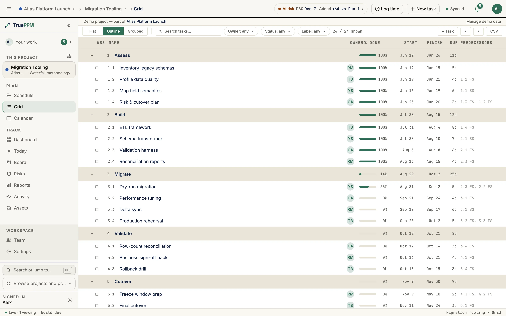

This is for anyone building or reading a project plan who wants to group related tasks into phases or deliverables. A **summary task** is a parent row in the Work Breakdown Structure (WBS) — the tree of phases and tasks that makes up the plan. A summary's duration, dates, and progress are computed automatically from its children; you never edit them directly on the summary itself.



Use summary tasks to group related work into phases, deliverables, or work packages.

## What rolls up

| Field | Rollup rule |
|-------|-------------|
| **Start** | Earliest start date among the children |
| **Finish** | Latest finish date among the children |
| **Duration** | Span from Start to Finish (working days, per the project calendar) |
| **% complete** | Duration-weighted average of the children's own percent complete |
| **Critical** | Marked critical if **any** task beneath it is on the critical path — the chain of dependent work driving the project's finish date |

Summary tasks cannot hold resource assignments, time entries, or direct dependencies. Add those on leaf tasks; the rollup will update on the next scheduler run.

The write restriction above is strictest for a **phase** — a summary with a real task nested under it, as opposed to one whose only children are checklist [subtasks](/features/subtasks/). See [Phases](#phases) below for exactly what's locked, why, and how the two cases differ.

## Phases

A **phase** is a summary task with at least one *structural* child — another
task, not a checklist subtask — nested under it in the WBS. It is not a field
you set: TruePPM never stores "this row is a phase" anywhere ([ADR-0293](/architecture/decisions/)).
The server derives it on every read, the same way it derives whether a row is
a summary at all, from whether the row has a real task beneath it in the tree.
Give a row a structural child — by indenting a task under it (`Alt` + `→`),
reparenting one onto it, or using **`+ Phase`** below — and it becomes a
phase; remove its last structural child and it stops being one.

This is the distinction that matters: a task broken into
[subtasks](/features/subtasks/) in its detail drawer is a summary (it has
children) but **not** a phase, because subtasks are checklist items, not
structural WBS children. It keeps its own assignee, status, and logged time
exactly as a leaf task does. Only a row with a real task nested under it in
the outline becomes a phase and picks up the locks below.

### What a phase cannot carry

A phase is a pure rollup — its status, estimate, and assignee are all computed
from its children — so the API refuses a direct write to any of them, and
refuses to let a checklist subtask be added straight into one:

| Write | Refusal message |
|---|---|
| `status` | "Phase status is rolled up from its children and cannot be set directly." |
| the [three-point estimate](/features/monte-carlo/#step-1--add-three-point-estimates-to-tasks) (`optimistic_duration` / `most_likely_duration` / `pessimistic_duration`) | "Phase estimates are rolled up from its children and cannot be set directly." |
| `assignee` | "A phase cannot be assigned — it is a rollup of its children, which carry their own assignees." |
| a logged time entry — manual, PATCH, or the running timer | "Time cannot be logged against a phase — it rolls up the logged time of its child tasks. Log against a leaf task instead." |
| adding a drawer subtask under a phase | "Phases group work — add tasks inside the phase, not subtasks." |
| `percent_complete` | the pre-existing summary-task lock above, unchanged |

Each lock fires only when a write actually tries to *change* the locked
value — a PATCH that omits the field, or resends the value already stored,
still succeeds. Set the assignee and log time on the leaf tasks inside the
phase instead; the phase rolls both up automatically. This is enforced in the
API itself, so an MCP client or any other direct caller is refused identically
to the UI.

Each refusal above also carries a stable internal code
(`phase_status_rollup_locked`, `phase_estimate_rollup_locked`,
`assignee_on_phase`, `time_log_on_phase`, `subtask_on_phase`) — but **don't
branch a client on it**. Per the [error reference](/api/errors/#codes-that-exist-in-code-but-not-on-the-wire),
this whole family never reaches the response body as a `code` key; only the
field-keyed message above does. Match on the field name, not the code.

### Adding a phase

The **`+ Phase`** button next to `+ Item` and `+ Milestone` inserts a new
summary row at the insertion point and creates its first task inside it in
the same action, so a phase is never left empty. With a task row focused
instead, the same button turns *that* row into a phase by adding a new first
task inside it — its label states which of the two it is about to do. The
keyboard shortcut is `⌥⌘P` (`Ctrl+Alt+P` on Windows and Linux) and works
either way, regardless of whether the button is showing.

`+ Phase` is off by default in the toolbar — turn it on from **Display →
Outline → Structure buttons** if you'd rather click than use the shortcut.
Indenting a task under another task (`Alt` + `→`) makes the same structural
change and needs no toggle.

A newly-inserted phase with no task inside it yet shows a small dashed hint
beside its name ("This phase has no items yet"); the hint disappears the
moment the row gains a real child, because at that point it already is one.

### Phases and sprints

Assigning a phase to a sprint is refused outright on the `sprint` field —
*"Phases group work; assign the tasks inside it to the sprint instead"* —
because a phase has no status or estimate of its own to burn down. (The
refusal carries the internal code `phase_in_sprint_forbidden`, which, like the
rollup-lock codes above, never reaches the response body — match on the field
name, not the code.) Unlike TruePPM's other sprint-composition guardrails,
this one is not escalatable or relaxable by a project's guardrail policy; it
applies unconditionally. Assign the phase's individual tasks to the sprint
instead. See [Sprint windows on the schedule](/features/schedule/sprint-windows/)
for how a sprint-driven phase reads on the Schedule.

## Gantt visual

Summary bars render as an 8px-tall filled bar with filled-diamond end-caps at the start and finish dates — the same diamond geometry used for milestones, rotated 45°. The end-caps disambiguate a summary from a regular task bar at a glance.

A chevron on the summary row collapses and expands the subtree:

- `▸` — collapsed
- `▾` — expanded

Collapsing a summary only hides its descendants from the list; it does not affect the schedule or the rollup.

The row states how many tasks are in the subtree beside its name — **`4 inside`**
when the summary is open, **`4 hidden`** when it is folded. This is drawn on the
row itself, not in a tooltip: a collapsed summary is otherwise indistinguishable
from one with no children at all, and that has to survive a glance down the
outline rather than requiring a hover on every row you are unsure about. The
same words are on the chevron's accessible name, so screen-reader and sighted
users read the identical phrase.

## Keyboard shortcuts (WBS view)

When a task row is focused in the WBS view:

| Shortcut | Action |
|----------|--------|
| `Alt` + `→` | Indent — make this task a child of the task above it |
| `Alt` + `←` | Outdent — move this task up one level in the hierarchy |
| `Alt` + `↑` / `Alt` + `↓` | Reorder within the current parent |
| `↑` / `↓` | Move focus to the previous / next visible task |
| `Enter` on chevron | Toggle expand / collapse of the focused summary |

Plain `Tab` and `Shift` + `Tab` are deliberately left alone on a focused row — they fall through to the browser's normal focus traversal, so a keyboard user can always Tab out of the grid.

Every indent and outdent announces what happened to screen-reader users — "Task indented", "Cannot outdent: task is already at root level", and so on.

Expanding or collapsing a summary announces `"<Name> expanded, N inside."` or
`"<Name> collapsed, N hidden."` — the same words the row and the chevron use, so
there is one vocabulary for the fact rather than one per surface. A summary with
no children states no count at all.

## Drag-and-drop indent

Dragging a task row onto a summary row in the WBS view re-parents the dragged task under that summary. A drop-zone indicator highlights the target summary, and an aria-live region announces `"<Task> will become child of <Summary>"` on hover before the drop commits.

Dropping onto the empty area below a summary's children inserts at the end of that subtree. The scheduler recomputes the rollup on the next tick.

## API

```http
GET /api/v1/tasks/?project={id}
```

Returns the full hierarchy with each task's `wbs_path` (ltree) and `parent_id`. Summary rows carry a read-only `is_summary` annotation so clients can render the chevron without a second query.

See the [API reference](/api/reference/) for the complete schema.

## Source

| Path | Purpose |
|------|---------|
| `src/features/grid/OutlineMode.tsx` | Outline table with keyboard + DnD handlers |
| `src/features/schedule/engine/GanttRenderer.ts` | `drawSummaryBar` — 8px bar with diamond end-caps |
| `src/features/schedule/wbsAnnouncement.ts` | Expand / collapse aria-live formatter |
| `src/hooks/useTaskMutations.ts` | `useIndentTask`, `useOutdentTask`, `useReorderTasks` |
| `src/stores/wbsStore.ts` | Expanded / collapsed state per summary |
